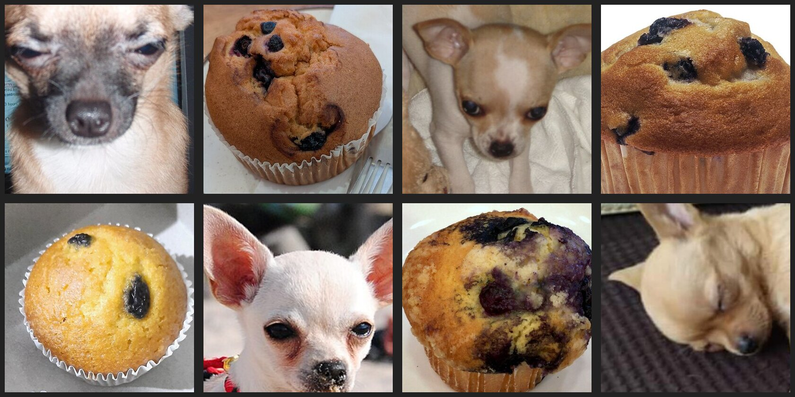

# Erfindergeist Jülich e.V.

- Gemeinnütziger Verein mit Sitz in Jülich, gegründet 2021
- Ziel: Förderung von Kreativität und Innovation durch praktisches Lernen und Zusammenarbeit
- Angebote: Workshops und Kreativ-Tage, Repair Café, Offene Werkstatt (3D-Drucker, Lasergravur, Holzverarbeitung, Textilveredelung)

Der 3D-Drucker der Offenen Werkstatt (Prusa Core One) ist der Bezugspunkt für den Hauptteil dieses Workshops: Wie entsteht mit KI ein 3D-Modell, das man drucken kann?

# Was ist KI?

**Künstliche Intelligenz (KI)** bezeichnet Computersysteme, die menschliche Fähigkeiten wie Lernen, Denken oder Entscheiden nachahmen. **Large Language Models (LLMs)** sind KI-Modelle, die auf riesigen Textmengen trainiert wurden. Sie verstehen und erzeugen Sprache.

Dienste wie ChatGPT, Copilot oder Gemini basieren auf LLMs, sind aber nicht die LLMs selbst – sie sind Anwendungen, die auf den Modellen aufbauen.

## Text-Modelle und multimodale Modelle

**Text-Modelle** verarbeiten nur Text (z.B. Llama 3, DeepSeek-R1). **Multimodale Modelle** verarbeiten zusätzlich Bilder, teils auch Audio (z.B. GPT, Claude, Gemini, Gemma 3). Sie „sehen“ Fotos, Screenshots, Diagramme und Handschrift – ohne zusätzliches Werkzeug.

| Eingabe | Text-Modell | Multimodales Modell |
|---|---|---|
| Foto, Screenshot | nicht möglich | direkt, ohne Hilfswerkzeug |
| PDF mit Text | Anwendung zieht vorher den Text heraus | Text, teils auch Seiten als Bild |
| Gescanntes PDF | nur mit Texterkennung (OCR) | Seiten werden als Bilder gelesen |

: {tbl-colwidths="[24,38,38]"}

Bilder versteht das multimodale Modell selbst. PDFs bereitet meist die Anwendung auf – Diagramme und Layout können dabei verloren gehen.

### Selbst ausprobieren: Chihuahua oder Muffin?

Das Bild in ein multimodales Modell hochladen und fragen: *„Welche Bilder zeigen einen Hund, welche einen Muffin?“*

{width="100%"}

Auflösung: Reihe 1: Hund, Muffin, Hund, Muffin – Reihe 2: Muffin, Hund, Muffin, Hund.

## Spezielle Coding-LLMs

Sprachmodelle, die besonders viel Programmcode gelernt haben. Sie schreiben und erklären Code, vervollständigen Code beim Tippen und können Programme selbst testen und Fehler beheben. Beispiele (Stand: Oktober 2026): Qwen3-Coder, Devstral, GPT-Codex.

## Was KI nicht ist

KI ist kein Zufallsgenerator und kein Taschenrechner. Sie sagt das *wahrscheinlichste* nächste Wort voraus. Fragt man nach einer „zufälligen Zahl“, kommt daher oft eine Zahl, die in den Trainingsdaten häufig vorkommt.

# Token, Parameter und Hardware

- **Token** sind die kleinsten Texteinheiten, in die ein KI-Modell Text zerlegt. Faustregel: 100 Token entsprechen etwa 75 Wörtern.
- **Parameter** sind die gelernten Zahlenwerte eines Modells. Ein 7B-Modell enthält 7 Milliarden davon.
- **Präzision** gibt an, wie viele Bits eine Zahl belegt. Mit 4 Bit (Q4) statt 16 Bit (FP16) sinkt der RAM-Bedarf auf etwa ein Viertel.
- **Tokens pro Sekunde (TPS)** misst, wie schnell ein Modell lokal antwortet.

| Modell | 16 Bit (FP16) | 4 Bit (Q4) |
|---|---|---|
| 3B | ca. 6 GB | ca. 2 GB |
| 7B | ca. 14 GB | ca. 4–5 GB |
| 13B | ca. 26 GB | ca. 8 GB |
| 70B | ca. 140 GB | ca. 40 GB |

: RAM-Bedarf (Richtwerte) {tbl-colwidths="[30,35,35]"}

| | Cloud | Lokal |
|---|---|---|
| Modellgröße | sehr groß (oft nicht veröffentlicht) | 7B–13B Parameter (quantisiert) |
| Geschwindigkeit | hängt vom Anbieter ab | hängt von eigener Hardware ab |
| Kontextfenster | bis ca. 1 Mio. Token | 4K–128K Token |
| Daten | verlassen den eigenen Rechner | bleiben auf dem eigenen Rechner |
| Kosten | laufend (Abo oder pro Token) | einmalig (Hardware) + Strom |

: Cloud und lokal im Vergleich (Stand: Oktober 2026) {tbl-colwidths="[22,39,39]"}

# Prompting

Ein **Prompt** ist die Eingabe an die KI. Der *System-Prompt* legt Rolle und Rahmen fest (oft unsichtbar), der *User-Prompt* enthält die eigentliche Frage.

## Die SAND-Methode

| | |
|---|---|
| **Situation** | Rolle der KI, Zielgruppe und Hintergrund (Kontext wie E-Mail, Webseite, PDF, Bild) |
| **Aufgabe** | Was soll die KI tun? (Text generieren, Code schreiben, Bild erstellen) |
| **Nebenbedingungen** | Regeln, Einschränkungen, Stil, Länge, Formatierung, Beispiele |
| **Darstellung** | Wie soll das Ergebnis aussehen? (Liste, Tabelle, Fließtext) |

: {tbl-colwidths="[25,75]"}

Beispiel ohne SAND: *„Schreib eine Einladung zum KI-Workshop.“* – die KI muss Zielgruppe, Ton, Länge und Format raten.

Beispiel mit SAND:

- **S:** Sie schreiben für einen Technik-Verein. Die Leser sind interessierte Laien ohne Vorwissen.
- **A:** Schreiben Sie eine Einladung zu unserem nächsten KI-Workshop.
- **N:** Maximal 120 Wörter, freundlich, Sie-Form, keine Fachbegriffe.
- **D:** Als E-Mail mit Betreffzeile und drei Stichpunkten zum Ablauf.

## Kontext und Kontextfenster

Manche Anwendungen haben ein Gedächtnis (Memory, frühere Chats, Zugriff auf Dateien), andere beginnen jeden Chat bei null. **Je weniger die KI weiß, desto mehr Kontext muss der Prompt liefern.**

Das **Kontextfenster** ist das Arbeitsgedächtnis des Modells. Prompt, Anhänge, Chatverlauf und Antwort müssen hineinpassen. Ist es voll, wird der Anfang des Chats „vergessen“. Faustregel: 1 Seite deutscher Text entspricht etwa 700 Token.

## Grenzen der Antworten

- **Nichtdeterminismus:** Gleicher Prompt, unterschiedliche Antworten.
- **Halluzination:** Das Modell erfindet plausibel klingende, aber falsche Fakten.
- **Bias:** Vorurteile aus den Trainingsdaten fließen in die Antworten ein.
- **Overreliance:** Zu viel Vertrauen in die KI – eigenes kritisches Denken leidet.

**Merke:** Antworten der KI immer hinterfragen und überprüfen.

# Eingabemöglichkeiten

| Art | Lokal | Cloud |
|---|---|---|
| Chat im Browser (Web-UI) | Open WebUI | ChatGPT, Claude.ai, Gemini |
| Terminal / Agent (CLI) | OpenCode | Claude Code |
| Im Editor (IDE) | VS Code + Continue | GitHub Copilot |

: {tbl-colwidths="[30,30,40]"}

- **Web-UI mit Tools:** Die Chat-Oberfläche stellt dem Modell Werkzeuge bereit (Websuche, Rechnen, Dateien lesen). Das Modell entscheidet, wann es ein Tool braucht; die Anwendung führt es aus.
- **Ollama + Open WebUI:** Ollama startet Sprachmodelle auf dem eigenen Rechner, Open WebUI ist die Chat-Oberfläche dazu. Alle Daten bleiben lokal.
- **Coding-Agenten (OpenCode, Claude Code):** KI im Terminal, die selbstständig Dateien liest und schreibt, Befehle ausführt und testet.
- **IDE:** KI direkt im Code-Editor, z.B. GitHub Copilot oder Continue mit Ollama.

**Code ist Text:** Alles, was man als Code beschreiben kann – Webseiten, Präsentationen, 3D-Modelle – kann KI gut erzeugen.

# 3D-Generierung mit KI

## Weg 1: Text – Code – 3D (OpenSCAD)

OpenSCAD beschreibt 3D-Objekte als Programmcode statt mit der Maus. Grundformen wie Zylinder, Quader und Kugeln werden kombiniert und verschoben. Eine KI wie Claude Code (Cloud) oder OpenCode mit einem lokalen Coding-Modell schreibt diesen Code aus einer Beschreibung in natürlicher Sprache.

Vorgehen: Objekt beschreiben, Code erzeugen lassen, Ergebnis prüfen, mit weiteren Prompts verfeinern. Bilder oder Skizzen als Teil des Prompts helfen sehr.

**Merke:** KI ersetzt keine CAD-Kenntnisse – sie macht den Einstieg deutlich einfacher.

## Weg 2: Bild – 3D

Aus einem Foto oder einer Zeichnung erzeugt die KI ein 3D-Modell (Mesh). Sie ergänzt dabei auch die nicht sichtbaren Seiten.

- **Lokal:** ComfyUI + Hunyuan3D – braucht eine leistungsstarke Grafikkarte
- **Cloud:** Meshy (meshy.ai) – keine Installation nötig
- **Ohne Installation testen:** Hunyuan3D-2.1 und Pixal3D auf HuggingFace

## Vergleich

| | Weg 1: OpenSCAD + KI | Weg 2: Bild zu 3D |
|---|---|---|
| Eingabe | Text (und Skizzen) | Foto oder Zeichnung |
| Ergebnis | Code, exaktes Modell | Mesh (Dreiecksnetz) |
| Maße | präzise, als Parameter änderbar | ungefähr, muss skaliert werden |
| Stärke | technische Teile, Gebäude | Figuren, organische Formen |
| Lokal | OpenCode + Ollama | ComfyUI + Hunyuan3D |
| Cloud | Claude Code | Meshy |

: {tbl-colwidths="[18,41,41]"}

# Vom Modell zum Druck

1. **Export:** OpenSCAD exportiert direkt als STL. Bild-zu-3D-Werkzeuge liefern oft GLB oder OBJ.
2. **Slicer** (z.B. PrusaSlicer): zerlegt das Modell in Schichten und erzeugt die Druckdatei.
3. **Drucken:** z.B. in der Offenen Werkstatt des Erfindergeist Jülich e.V.

Typische Probleme bei KI-Modellen: fehlende echte Maße (im Slicer skalieren), Löcher im Mesh, zu dünne Wände, Überhänge ohne Stützmaterial.

<!-- TODO: Bonus HuggingFace (FLUX.1, Wan2.2, Whisper, Kokoro) kurz zusammenfassen -->

# Bonus: Termine-Webseite

## Plan

Der Ursprüngliche plan war ca. 50% kleiner. Mit hilfe der KI und geschicktem fragen wie was sollte noch rein, was habe ich vergessen, was könnte noch interessant sein, konnten wir den Inhalt deutlich erweitern. Wurde der Plan finalisiert.

````markdown
# Plan: termine/index.html — Erfindergeist Jülich Technik-Erklärer

## Context
Leere Single-Page-Website im Ordner `termine/`, die die technische Infrastruktur des Vereins Erfindergeist Jülich erklärt (NextCloud → WordPress-Plugin → REST-API / ICS / PDF-Pipeline). Zielgruppe: Kinder + Erwachsene. CI: Primary #159989, Secondary #F9B338.

---

## Dateistruktur

```
termine/
├── index.html
├── css/
│   ├── bootstrap.min.css        (Bootstrap 5.3.x)
│   ├── aos.min.css              (Animate On Scroll)
│   └── main.css                 (Custom styles + CSS-Variablen)
├── js/
│   ├── lib/
│   │   ├── jquery.min.js            (jQuery 3.7.x)
│   │   ├── bootstrap.bundle.min.js  (Bootstrap 5.3.x)
│   │   ├── gsap.min.js              (GSAP 3.x Core)
│   │   ├── ScrollTrigger.min.js     (GSAP Plugin)
│   │   ├── aos.min.js               (AOS)
│   │   ├── typed.min.js             (Typed.js)
│   │   ├── lucide.min.js            (Lucide Icons)
│   │   └── rough-notation.min.js    (Rough Notation)
│   ├── i18n.js          (Translations DE/EN + Toggle-Logik)
│   ├── theme.js         (Dark/Light Mode + localStorage)
│   ├── accessibility.js (Accessibility-Toolbar + font-scale + high-contrast)
│   ├── animations.js    (GSAP + AOS Initialisierung, SVG-Pfeil-Animationen)
│   └── main.js          (App-Init, scroll-to-top, Event-Listener, Bootstrap-Glue)
├── fonts/
│   ├── Caveat-Regular.ttf       (handschriftliche Überschriften)
│   └── Caveat-Bold.ttf          (handschriftliche Überschriften fett)
└── img/
    └── logo.svg                 (Platzhalter — User ersetzt)
```

---

## Entscheidungen (bestätigt)
- **Logo**: Querformat/landscape (~200×60px) für Navbar
- **Dateiformat**: Reines HTML (statisch, kein PHP)
- **Sprache**: Deutsch als Default, EN per Toggle
- **Alle 4 Extra-Libraries**: Typed.js + AOS + Rough Notation + Lucide Icons

## Bibliotheken (alle lokal, alle kostenlos)

| Library | Zweck | Download |
|---|---|---|
| Bootstrap 5.3.x | Layout, Komponenten | getbootstrap.com |
| jQuery 3.7.x | DOM-Manipulation, Events | jquery.com |
| GSAP 3 + ScrollTrigger | Animationen (fly-in, Pfeile, Stagger) | gsap.com/free |
| AOS | Scroll-reveal für Cards | michalsnik.github.io/aos |
| Typed.js | Tipp-Animation im Hero | mattboldt.com/demos/typed-js |
| Lucide Icons | SVG-Icon-Library | lucide.dev |
| Rough Notation | Handgezeichnete Highlights um Schlüsselbegriffe | roughnotation.com |

> Keine DrawSVG (kostenpflichtig) — SVG-Pfad-Animationen mit CSS `stroke-dasharray` + GSAP/ScrollTrigger.

---

## Sections / Menü

| Anker | DE | EN |
|---|---|---|
| `#uebersicht` | Übersicht | Overview |
| `#architektur` | Technischer Aufbau | Architecture |
| `#ics` | ICS Kalender | ICS Calendar |
| `#plugin` | WordPress Plugin | WordPress Plugin |
| `#pdf-generator` | PDF Generator | PDF Generator |
| `#downloads` | Downloads | Downloads |
| `#api` | REST API & JSON | REST API & JSON |
| `#homeassistant` | Home Assistant | Home Assistant |

---

## Komponenten-Details

### Navbar (sticky)
- Logo links (landscape/quer — ~200×60px)
- Menüpunkte mit smooth scroll
- Rechts: Dark/Light Toggle + DE/EN Toggle
- Mobile: Hamburger mit Bootstrap Offcanvas

### Accessibility Toolbar (bottom-left, fixed)
- Button mit Lucide `accessibility` Icon
- Slide-up Panel:
  - Schriftgröße: A− / A / A+ (--font-scale CSS-Variable)
  - Kontrast: Normal / Hoch (class `high-contrast` auf `<html>`)
  - Animationen: An / Aus (class `reduce-motion` überschreibt prefers-reduced-motion)
- Vollständig tastaturzugänglich, ARIA-labeled
- Speichert Präferenz in localStorage

### Scroll-to-Top Button (bottom-right, fixed)
- Erscheint nach 300px Scroll
- Lucide `arrow-up` Icon
- GSAP fade-in/out

### Hero Section
- Großer Titel mit GSAP cascade-in
- Typed.js Untertitel: "ICS Kalender" → "WordPress Plugin" → "PDF Termine" → "REST API" → "Home Assistant"
- Kurze Intro DE/EN

### Card: Technischer Aufbau (SVG-Diagramm)
- Inline SVG Flussdiagramm:
  ```
  [NextCloud] ──► [WordPress + Plugin]
                         │
           ┌─────────────┼──────────────┐
           ▼             ▼              ▼
  [GitHub pdf-termine] [/events JSON] [/ics]
           │
     ┌─────┤
     ▼     ▼
  [PDF] [Share Server]
  ```
- GSAP + ScrollTrigger: Pfeile zeichnen sich per `stroke-dashoffset` ein
- Nodes pulsieren beim Hover

### Card: Was ist ICS?
- Animated Kalender-Icon (Lucide `calendar-days`)
- Erklärung mit Kinder-Analogie
- Live-Link: https://erfindergeist.org/wp-json/erfindergeist/v2/ics
- Code-Snippet mit Beispiel-ICS-Block

### Card: WordPress Plugin
- GitHub-Link: https://github.com/ErfindergeistJuelichOfficial/calendar-wp-plugin
- Was es tut: NextCloud-Daten abrufen, cachen, als REST-API bereitstellen
- 3 Endpoint-Cards klickbar:
  - `/ics` → https://erfindergeist.org/wp-json/erfindergeist/v2/ics
  - `/events` → https://erfindergeist.org/wp-json/erfindergeist/v2/events
  - `/tomorrow` → https://erfindergeist.org/wp-json/erfindergeist/v2/tomorrow

### Card: PDF Generator (pdf-termine)
- GitHub-Link: https://github.com/ErfindergeistJuelichOfficial/pdf-termine
- Erklärt GitHub Actions Automation
- Animiertes Flussdiagramm: Trigger → Daten holen → PDF rendern → auf Share hochladen

### Card: Downloads
- 4 Download-Cards mit PDF-Icon (Lucide `file-text`):
  - terminuebersicht_hoch.pdf → https://share.erfindergeist.org/terminuebersicht_hoch.pdf
  - terminuebersicht_quer.pdf → https://share.erfindergeist.org/terminuebersicht_quer.pdf
  - termine_repaircafe_hoch.pdf → https://share.erfindergeist.org/termine_repaircafe_hoch.pdf
  - termine_repaircafe_quer.pdf → https://share.erfindergeist.org/termine_repaircafe_quer.pdf

### Card: Was ist JSON?
- Kinder-Analogie: "Wie eine Zutatenliste beim Backen"
- JSON-Snippet (hardcoded Beispiel)

### Card: Was ist REST?
- Analogie: "Kellner im Restaurant" (Client = Gast, API = Kellner, Server = Küche)

### Card: Home Assistant & Tomorrow
- Erklärt warum `/tomorrow` für HA-Automationen ideal ist
- Beispiel HA-Automation YAML
- Lucide `home` + `zap` Icons

### Bonus Card: Was ist Caching?
- Erklärt warum das Plugin cached (weniger Last auf NextCloud)
- Vorher/Nachher-Diagramm

---

## Typografie

```css
@font-face {
  font-family: 'Caveat';
  src: url('../fonts/Caveat-Regular.ttf') format('truetype');
  font-weight: 400;
}
@font-face {
  font-family: 'Caveat';
  src: url('../fonts/Caveat-Bold.ttf') format('truetype');
  font-weight: 700;
}
h1, h2, h3 { font-family: 'Caveat', cursive; }
```

Caveat von Google Fonts (OFL-Lizenz, kostenlos, lokal in `fonts/`).

---

## CSS-Architektur

```css
:root {
  --color-primary: #159989;
  --color-secondary: #F9B338;
  --color-bg: #f6fbfa;
  --color-surface: #ffffff;
  --color-text: #1a2e2c;
  --font-scale: 1;
}
[data-theme="dark"] {
  --color-bg: #0d1918;
  --color-surface: #162624;
  --color-text: #e0f0ee;
}
.high-contrast { /* WCAG AAA Kontrast-Variablen */ }
.reduce-motion * { animation-duration: 0.01ms !important; }
```

---

## JS-Module

### `js/i18n.js`
- `translations.de` / `translations.en` Objekt
- `window.t(key)` Hilfsfunktion
- `applyTranslations(lang)` — updated alle `[data-i18n]` Elemente + `[data-i18n-attr]`
- `toggleLanguage()` / `initI18n()`
- localStorage-Persistenz, `lang`-Attribut auf `<html>`

### `js/theme.js`
Dark/Light Toggle, `data-theme` auf `<html>`, localStorage-Persistenz, respektiert `prefers-color-scheme`.

### `js/accessibility.js`
Toolbar-Panel (slide-up), font-scale CSS-Variable, high-contrast class, reduce-motion override. Alle Buttons mit ARIA, Escape-Taste schließt Panel.

### `js/animations.js`
- GSAP Hero cascade-in
- Architektur-SVG: `stroke-dashoffset` Pfeil-Animation via ScrollTrigger
- AOS.init() für alle Cards
- Typed.js im Hero
- Rough Notation Highlights auf `.rn-highlight` Elementen
- Prüft `.reduce-motion` und überspringt alle Animationen

### `js/main.js`
App-Init, scroll-to-top (GSAP fade), aktive Nav-Links tracken, smooth scroll, offcanvas schließen.

---

## Zugänglichkeit (WCAG 2.1 AA)
- Skip-to-content Link ganz oben
- Alle interaktiven Elemente mit `:focus-visible` Outline (3px solid secondary)
- `aria-label` auf Icons, `aria-expanded` auf Toggle-Buttons
- `lang` Attribut auf `<html>` wechselt mit SprachToggle
- Farbkontraste ≥ 4.5:1 für Text, ≥ 3:1 für UI
- Alle dekorativen SVGs/Bilder: `aria-hidden="true"`
- Alle informativen SVGs/Bilder: `alt` Text
- `prefers-reduced-motion` wird respektiert

---

## Implementierungsreihenfolge (erledigt)

0. ✅ CLAUDE.md erstellen
1. ✅ Assets herunterladen (Bootstrap, jQuery, GSAP, AOS, Typed.js, Lucide, Rough Notation, Caveat)
2. ✅ index.html Grundgerüst + Navbar + alle Sections
3. ✅ main.css (CSS-Variablen, Dark Mode, Accessibility, Layout)
4. ✅ JS-Module (i18n.js, theme.js, accessibility.js, animations.js, main.js)
5. ✅ Logo-Platzhalter (img/logo.svg)

---

## Verifikation
- Im Browser öffnen: lokaler Webserver oder `file:///.../termine/index.html`
- Responsive testen: Chrome DevTools → Mobile/Tablet/Desktop
- Dark Mode, Sprach-Toggle, Accessibility-Panel testen
- Alle Links auf Share-Server und GitHub prüfen
- GSAP Animationen auf `prefers-reduced-motion: reduce` testen
- Logo ersetzen: `img/logo.svg` durch eigenes Querformat-Logo (~200×60px)

````


## Prompt-Beispiel: Herzanimation

1. Prompt Puls Definieren:

```text
Das Herz im Sponsoring-Bereich soll folgende animation haben https://gsap.com/community/forums/topic/28814-using-gsap-to-loop-a-pulsing-animation/ 

```

2. Prompt Animation Verfeinerung

```text
Die Puls Animation beim Herz im Sponsoring Bereich soll herzförmig aussehen statt als Kreis.
```

# Bonus: Azure Showcases

<!-- TODO: Unternehmens-Showcases ergänzen -->

Weitere Szenarien: Microsoft Scenario Library, <https://adoption.microsoft.com/de-de/scenario-library/>

# Referenzen

Alle Links abgerufen am 09.10.2026.

- Ollama: <https://ollama.com>
- Open WebUI: <https://openwebui.com>
- OpenCode: <https://opencode.ai>
- Claude Code: <https://www.anthropic.com/claude-code>
- OpenSCAD: <https://openscad.org>
- ComfyUI: <https://www.comfy.org>
- Meshy: <https://www.meshy.ai>
- HuggingFace: <https://huggingface.co>
- Hunyuan3D-2.1: <https://huggingface.co/spaces/tencent/Hunyuan3D-2.1>
- Pixal3D: <https://huggingface.co/spaces/TencentARC/Pixal3D>
- FLUX.1: <https://huggingface.co/spaces/black-forest-labs/FLUX.1-schnell>
- Whisper: <https://huggingface.co/spaces/hf-audio/whisper-large-v3>
- Kokoro TTS: <https://huggingface.co/spaces/hexgrad/Kokoro-TTS>
- Präsentation online: <https://presentations.erfindergeist.org/ki2/>
