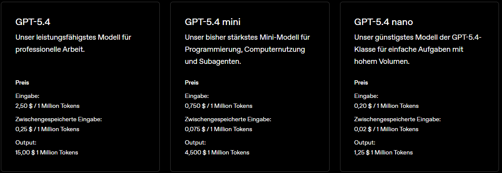

# Vorstellung Erfindergeist Jülich e.V

* Gemeinnütziger Verein mit Sitz in Jülich, gegründet 2021
* **Ziel**: Förderung von Kreativität und Innovation durch praktisches Lernen und Zusammenarbeit
* Angebote
  * Workshops und Kreativ-Tage (Robotik-, Künstliche Intelligenz-, Podcast-Workshops, etc.)
  * Repair Cafe
  * Offene Werkstatt (3D-Drucker, Lasergravur, Holzverarbeitung, Textilveredelung, etc.)

# Vorstellung Sprecher

::: columns
::: {.column width="35%"}
BILD BILD BILD BILD
:::

::: {.column width="3%"}
:::

::: {.column width="62%"}
text text text text text text text text text
:::
:::

# Agenda

* Was ist KI?
* Was sind Token?
* Was sind Parameter?
* Lokal: Ollama und OpenWeb UI (Fragen, Zusammenfassung, Diskussion)
* Lokal: OpenCode (Programmierhilfe)
* Lokal: ConfyUI (Bilderzeugung)
* Cloud: Meshy (3D-Modellierung)
* Cloud: Azure Showcases

::: {.notes}
Speaker notes go here.
:::

# Was ist KI?

Künstliche Intelligenz (KI) sind Computersysteme, die menschliche Fähigkeiten wie Lernen, Denken oder Entscheiden nachahmen. Large Language Models (LLM) sind eine spezielle Form der KI, die auf riesigen Textmengen trainiert werden. Sie verstehen und erzeugen Sprache, beantworten Fragen, schreiben Texte oder helfen bei der Analyse von Informationen

# Was sind Token?

- Es ist eine Art von "Währung", die verwendet wird, um die Nutzung von Cloud KI-Modellen zu bezahlen.

- Jedes Wort, Satzzeichen oder Leerzeichen zählt meist als 1 Token. Es kommt auf den Anbieter und das Modell an.
-  Beispiel: „Hallo Welt!“ → 3 Token („Hallo“, „ Welt“, „!“).

- Ein Token ist nicht immer ein ganzes Wort. Das Wort „Apfel“ ist vielleicht ein Token, „Verständnisfragen“ hingegen werden in mehrere Tokens zerlegt.

- Faustregel: 100 Token entsprechen etwa 75 Wörtern.

## Kosten ChatGPT

::: aside
Auszug `https://openai.com/de-DE/api/pricing/` vom 09.04.2026
:::

## Beispiel Rechnung Buch

- Moderne Krimis haben etwa 100.000 Wörter, das wären ca. 133.000 Token.
- Bei ChatGPT würde dies ca. 2 USD kosten.

- Achtung, keine KI kann ein ganzes Buch auf einmal verarbeiten, es müsste in kleinere Abschnitte aufgeteilt werden, was die Kosten erhöhen könnte.

## Was sind Parameter?

- Parameter sind die "Einstellungen" oder "Regler", die die Funktionsweise eines KI-Modells beeinflussen. Sie bestimmen, wie das Modell auf Eingaben reagiert und welche Art von Ausgaben es generiert.

- Je Mehr Parameter ein Modell hat, desto komplexer und leistungsfähiger ist es in der Regel, aber es wird auch mehr RAM benötigt.

## RAM Anforderungen von KI-Modellen

* 3B (3 Milliarden Parameter): ~6 GB 
* 7B (7 Milliarden Parameter): ~14 GB
* 13B (13 Milliarden Parameter): ~26 GB 
* 70B (70 Milliarden Parameter): ~140 GB

## Tokens pro Sekunde

- Tokens pro Sekunde (TPS) ist eine Metrik, die angibt, wie viele Tokens ein KI-Modell in einer Sekunde verarbeiten oder generieren kann. Es ist ein Maß für die Geschwindigkeit und Effizienz eines Modells.

- Beispiel: eine Nvidia RTX 4090 kann zwischen 4-8 TPS erreichen, abhängig von der Modellgröße und der Komplexität der Aufgabe.

# Lokal: Ollama und OpenWeb UI

- Ollama ist ein lokal bereitgestellter KI-Modell-Runner, der es Benutzern ermöglicht, große Sprachmodelle (LLMs) direkt auf ihrem PC auszuführen, ohne auf Cloud-Dienste angewiesen zu sein. Es bietet eine benutzerfreundliche Oberfläche und unterstützt verschiedene KI-Modelle, die lokal installiert werden können.

- OpenWeb UI ist eine Open-Source-Webanwendung, die es Benutzern ermöglicht, KI-Modelle über eine benutzerfreundliche Weboberfläche zu nutzen. Es bietet Funktionen wie Textgenerierung, Chatbot-Interaktionen und mehr, und kann sowohl lokal als auch in der Cloud betrieben werden.

- Beispiele in OpenWeb Ui zeigen. Überlegen was gut ist

# Loka: OpenCode

- OpenCode ist eine KI-gestützte Programmierhilfe, die Entwicklern dabei hilft, Code schneller und effizienter zu schreiben. Es bietet Funktionen wie Code-Vervollständigung, Fehlererkennung und Vorschläge für Verbesserungen, um den Entwicklungsprozess zu optimieren.

- Beispiele in OpenCode zeigen. Überlegen was gut ist

# Lokal: ConfyUI

- ConfyUI ist eine KI-gestützte Anwendung zur Bilderzeugung, die es Benutzern ermöglicht, durch die Eingabe von Textbeschreibungen oder anderen Anweisungen automatisch Bilder zu generieren. Es nutzt fortschrittliche KI-Modelle, um kreative und realistische Bilder basierend auf den gegebenen Eingaben zu erstellen.

TODO: Beispiel Bilder einfügen

# Cloud: Meshy

- Meshy ist eine KI-gestützte 3D-Modellierungsplattform, die es Benutzern ermöglicht, komplexe 3D-Modelle durch einfache Textbeschreibungen oder andere Anweisungen zu erstellen. Es nutzt fortschrittliche KI-Technologien, um realistische und detaillierte 3D-Modelle zu generieren, die in verschiedenen Anwendungen wie Spieleentwicklung, Animation oder Produktdesign verwendet werden können.

TODO: Gezeichnetes Bild -> 3D-Modell Abbildung einfügen

# Cloud: Azure Showcases

# Aside

Hallo Welt

::: aside
Fussnote: Some additional commentary of more peripheral interest.
:::

# Referenzen

- [openai.com](https://openai.com)
- [ollama.com](https://ollama.com)
- [openwebui.com](https://openwebui.com)
- [opencode.ai](https://opencode.ai)
- [confyui.com](https://confyui.com)
- [meshy.ai](https://meshy.ai)
- [Azure KI](https://azure.microsoft.com/de-de/solutions/ai)

# Ende

- Vielen Dank für die Teilnahme!
- [Präsentation Online anschauen](https://presentations.erfindergeist.org/ki2/)
- [Download Präsentation als PDF](https://presentations.erfindergeist.org/ki2/index.pdf)
- [erfindergeist.org](https://erfindergeist.org)
- TODO: Fragen, Anmerkungen, Feedback?
