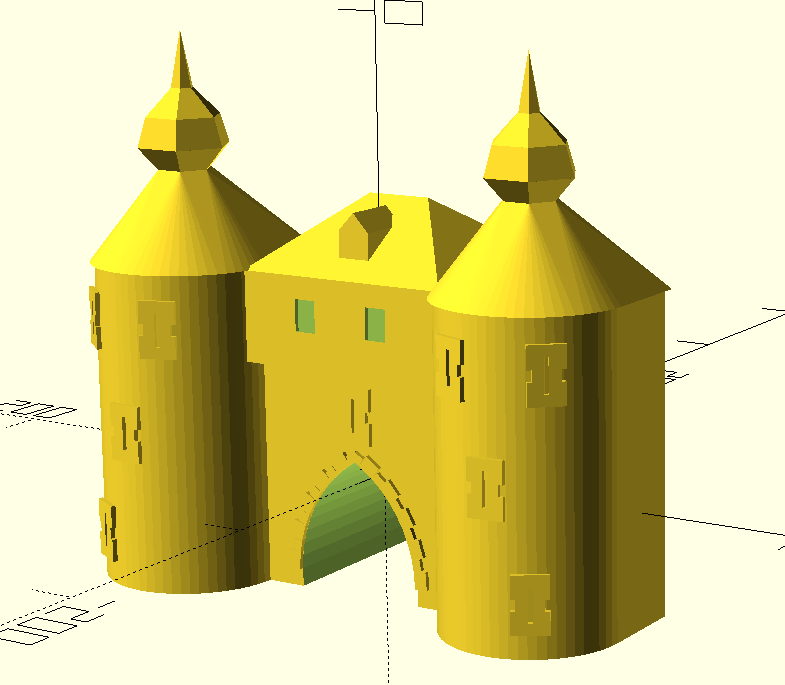
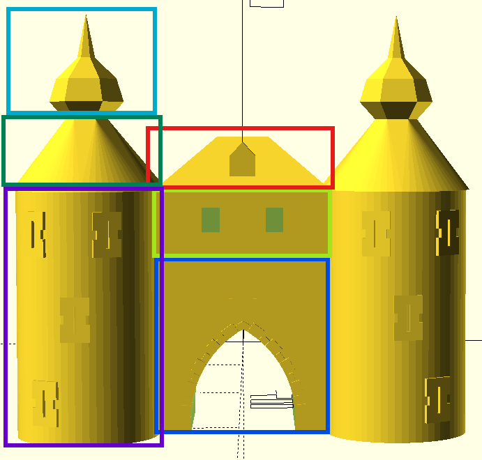
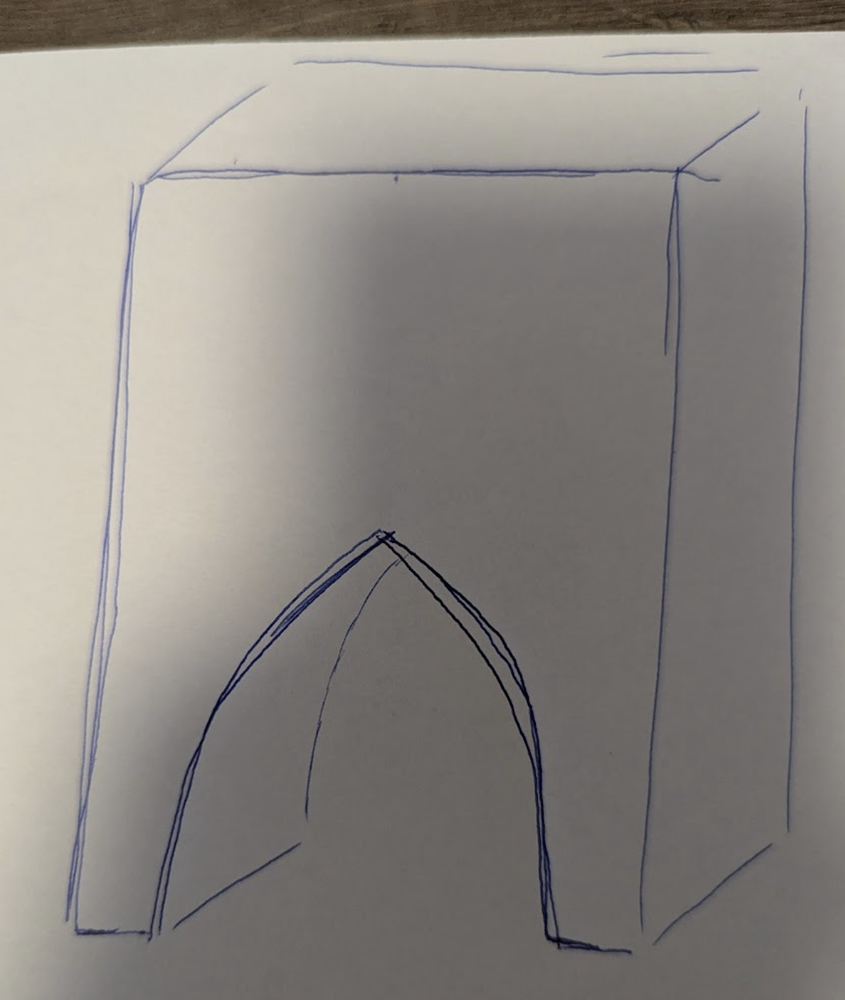
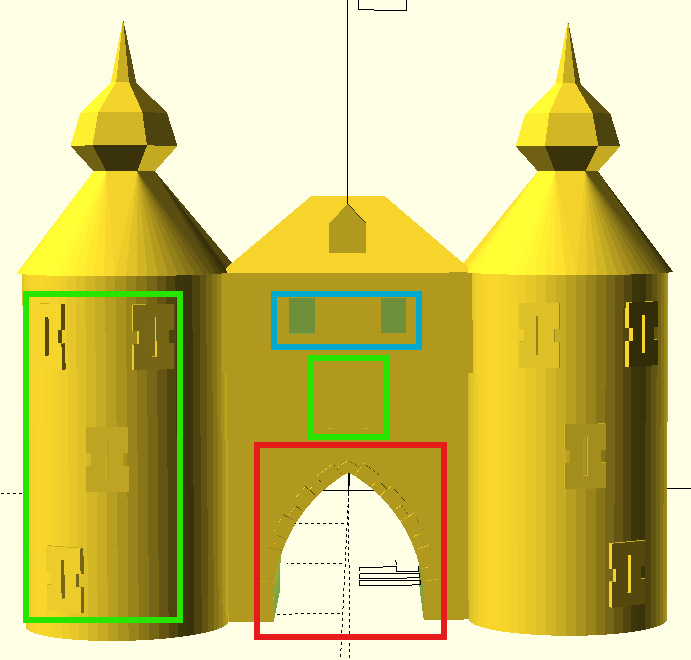
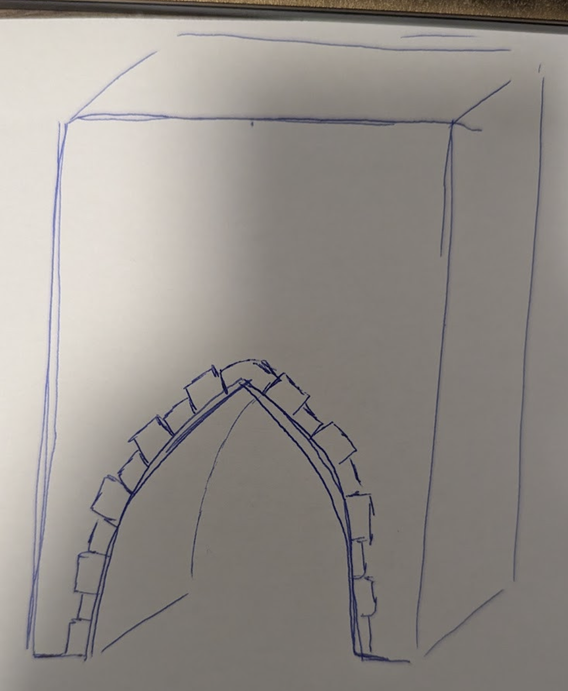

<!-- Die Präsentation ist Online unter https://presentations.erfindergeist.org/ki2/ zu finden -->

<!-- Der Veranstalter: Erfindergeist Jülich e.V. stellt sich kurz vor -->
# Vorstellung Erfindergeist Jülich e.V

* Gemeinnütziger Verein mit Sitz in Jülich, gegründet 2021
* **Ziel**: Förderung von Kreativität und Innovation durch praktisches Lernen und Zusammenarbeit
* Angebote
  * Workshops und Kreativ-Tage (Robotik-, Künstliche Intelligenz-, Podcast-Workshops, etc.)
  * Repair Cafe
  * Offene Werkstatt (3D-Drucker, Lasergravur, Holzverarbeitung, Textilveredelung, etc.)


::: {.notes}
Speaker notes go here.
:::

## Spenden


::: columns
::: {.column width="70%"}

- Erfindergeist Jülich e.V. finanziert sich ausschließlich durch Mitgliedsbeiträge und Spenden. Wir Danken allen Unterstützern, die unsere Arbeit ermöglichen!

- Spenden Konto und PayPal auf unserer Webseite [https://linktree.erfindergeist.org/](https://linktree.erfindergeist.org/)

:::
::: {.column width="30%"}

{width="100%"}

:::
:::


# Wie läuft es heute ab

Heute führen wir Sie Schritt für Schritt durch die Welt der KI —
von den Grundlagen bis zu echten Unternehmensanwendungen.

Wir zeigen, demonstrieren und beantworten Ihre Fragen.

## Wie läuft es heute ab: Theorie

**Was wir erklären:**

- Was ist KI — und was ist sie *nicht*?
- Wie funktionieren große Sprachmodelle?
- Was sind Token und warum sind sie wichtig?

Ziel: gemeinsames Grundverständnis für alles, was danach kommt.

## Wie läuft es heute ab: Lokal-Demos

**Was wir live vorführen — auf unserer eigenen Hardware:**

- **Ollama + OpenWeb UI** — KI-Chatbot ohne Internet und Cloud
- **OpenCode** — KI unterstützt beim Programmieren
- **ComfyUI** — KI generiert Bilder aus Text

Sie sehen, wie leistungsfähig KI auf lokalem Equipment läuft.

## Wie läuft es heute ab: Cloud-Demos

**Was wir über Cloud-Dienste zeigen:**

- **3D-Modellierung: OpenSCAD + Claude Code** — 3D-Modelle aus Text erstellen (technisch)
- **Meshy** — 3D-Modelle aus Text oder Skizzen erstellen (Kreativ)
- **Azure KI-Dienste** — Unternehmensgrade KI-Integration von Microsoft

Sie sehen den Unterschied zwischen lokalem Betrieb und Cloud-Skalierung.

## Wie läuft es heute ab: HuggingFace

**Was wir über HuggingFace zeigen:**

- **FLUX.1** — Text-zu-Bild: aus einer Beschreibung wird ein Bild generiert
- **Wan2.2** — Text-zu-Video: aus einer Beschreibung wird ein kurzes Video generiert
- **Whisper** — Sprache-zu-Text: gesprochene Sprache wird automatisch transkribiert
- **Kokoro TTS** — Text-zu-Sprache: Texte werden in natürliche Stimmen umgewandelt
- **Pixal3D** — Bild-zu-3D: ein Foto wird in ein 3D-Modell verwandelt

Offene Modelle, die jeder kostenlos ausprobieren kann — direkt im Browser.

## Wie läuft es heute ab: Unternehmens-Showcase

**Echte KI-Anwendungen aus der Praxis:**

- Eine Firma stellt mehrere konkrete Fallbeispiele vor
- Von der Problemstellung zur KI-Lösung
- Was funktioniert gut — und wo sind die Grenzen?

Praxisbezug für alle, die KI im Berufs- oder Unternehmenskontext einsetzen wollen.

## Wie läuft es heute ab: Fragen & Diskussion

**Sie sind nicht nur Zuschauer:**

- Nach jeder Phase: Zeit für Fragen
- Am Ende: offene Diskussionsrunde

Kein Vorwissen nötig — jede Frage ist willkommen.


# Was ist KI?

- **Künstliche Intelligenz (KI)** bezeichnet Computersysteme, die menschliche Fähigkeiten wie Lernen, Denken oder Entscheiden nachahmen. Indem es Mathematische Modelle und Algorithmen verwendet, kann KI Muster erkennen, Vorhersagen treffen und Probleme lösen.

- KI umfasst viele Bereiche: Bilderkennung, Sprachverarbeitung, Empfehlungssysteme und mehr.

- **Large Language Models (LLM)** sind eine spezielle Form der KI, trainiert auf riesigen Textmengen — sie verstehen und erzeugen Sprache, beantworten Fragen und helfen bei der Analyse von Informationen.

## Was ist KI?: Was ist KI nicht

- Experiment. besuchen Sie **https://chatgpt.com/** und fragen Sie "Nenne mir eine zufällige Zahl."

- KI generiert Antworten, indem es die wahrscheinlichsten nächsten Wörter vorhersagt, basierend auf den Mustern, die es in den Trainingsdaten gelernt hat. Daher ist die Antwort nicht wirklich zufällig, sondern eine Zahl, die in den Trainingsdaten häufig vorkommt oder als wahrscheinlich angesehen wird. In diesem Fall könnte es sein, dass die Zahl 73 oft in den Daten vorkommt.

<!-- Ziel ist es aufzuzeigen wo die unterscheide zwischen Tokens in der Cloud und Lokal liegen. Am ende muss jeder Teilnehmer die Unterschiede verstehen. Die Tiefe sollte sich auf Parameter und Präzision beschränken-->
# Token

- Token sind die kleinsten Texteinheiten, in die ein KI-Modell Text zerlegt. Gleichzeitig dienen sie als Abrechnungseinheit bei Cloud-Diensten.

- Jedes Wort und Satzzeichen zählt meist als 1 Token. Leerzeichen werden typischerweise dem nächsten Token vorangestellt, nicht als eigenes Token gezählt.

- Ein Token ist nicht immer ein ganzes Wort. Das Wort „Apfel” ist vielleicht ein Token, „Verständnisfragen” hingegen werden in mehrere Tokens zerlegt.


## Token: Beispiele

- Beispiel: „Hallo Welt!” → 3 Token („Hallo”, „ Welt”, „!”).

- Faustregel: 100 Token entsprechen etwa 75 Wörtern.

- Interaktiv ausprobieren: [platform.openai.com/tokenizer](https://platform.openai.com/tokenizer)

## Token: Kosten ChatGPT


::: aside
Auszug [https://openai.com/de-DE/api/pricing/](https://openai.com/de-DE/api/pricing/) vom 09.04.2026 — Preise ändern sich häufig, bitte aktuell prüfen.
:::

## Token: Beispiel Rechnung Buch

- Moderne Krimis haben etwa 100.000 Wörter, das wären ca. 133.000 Token.
- Bei ChatGPT (GPT-4o) würde dies ca. **0,33 USD** kosten — bei teureren Modellen entsprechend mehr (vgl. nächste Folie).

- Achtung: Jedes KI-Modell hat ein begrenztes **Kontextfenster** — die maximale Anzahl an Token, die es auf einmal verarbeiten kann (z.B. 128.000 Token bei GPT-4o). Ein ganzes Buch übersteigt dieses Limit und müsste in kleinere Abschnitte aufgeteilt werden, was die Kosten erhöhen könnte. Das Kontextfenster erklärt auch, warum eine KI frühere Gesprächsteile "vergessen" kann.

## Token: Was sind Parameter?

Wer KI lokal betreiben will, muss verstehen: wie viel RAM braucht ein Modell? Das hängt direkt von den Parametern ab.

- Parameter sind die gelernten Zahlenwerte eines Modells. Ein **7B-Modell** enthält **7.000.000.000 solcher Zahlen** — sie bestimmen gemeinsam, wie das Modell auf Eingaben reagiert.

- Je mehr Parameter, desto leistungsfähiger — aber auch desto mehr RAM wird benötigt.

## Token: Präzision

**Präzision** beschreibt, wie viele Bits eine Zahl im Modell belegt. Mehr Bits = mehr RAM, aber nicht zwingend bessere Alltagsqualität.

RAM-Bedarf bei voller Präzision (FP16 = 16 Bit pro Zahl, 2 Bytes/Parameter)

## Token: RAM Anforderungen

* 3B (3 Milliarden Parameter): ~6 GB
* 7B (7 Milliarden Parameter): ~14 GB
* 13B (13 Milliarden Parameter): ~26 GB
* 70B (70 Milliarden Parameter): ~140 GB

In der Praxis verwendet Ollama quantisierte Modelle (4-bit) — jede Zahl belegt nur noch 4 statt 16 Bit, der RAM-Bedarf sinkt auf **25 %**, bei kaum merklichem Qualitätsverlust — z.B. ~4–5 GB für ein 7B-Modell.


## Token: Tokens pro Sekunde

- **Tokens pro Sekunde (TPS)** ist das lokale Pendant zur Cloud-Abrechnung: statt Kosten pro Token misst man hier die Geschwindigkeit — wie viele Token das Modell pro Sekunde ausgibt.

- Beispiel: eine Nvidia RTX 4090 (24 GB VRAM) erreicht mit Ollama typischerweise:
  - ~80–120 TPS für ein 7B-Modell (Q4) — flüssig lesbar
  - ~40–60 TPS für ein 13B-Modell (Q4) — ebenfalls flüssig
  - 70B-Modelle (Q4 ~35 GB) passen nicht mehr in den VRAM einer einzelnen Karte

## Token: Was sagt uns das nun?

|                   | **Cloud**                        | **Lokal**                          |
|-------------------|----------------------------------|------------------------------------|
| Token =           | Abrechnungseinheit               | Geschwindigkeitsmaß (TPS)          |
| Typische Modelle  | 500B+ Parameter                  | 7B–13B Parameter (quantisiert)     |
| Kosten            | Laufend, pro Token               | Einmalig (Hardware)                |
| Kontextfenster    | 128K+ Token                      | 4K–128K Token (modellabhängig)     |
| RAM-Bedarf        | Kein eigener                     | 4–26 GB je nach Modell             |

: {tbl-colwidths="[22,39,39]"}

# 3D-Modellierung: OpenSCAD + Claude Code

**OpenSCAD** ist eine Programmiersprache für 3D-Modelle — statt mit der Maus zu modellieren, beschreibt man das Modell als Code.

**Das Prinzip:** Prompt an Claude Code → SCAD-Code → fertiges 3D-Modell

Beispiel: Der **Hexenturm Jülich** — ein historisches Wahrzeichen, nachgebaut aus Code.

## 3D-Modellierung: Was ist OpenSCAD?

::: columns
::: {.column width="60%"}
- OpenSCAD beschreibt 3D-Objekte als **parametrischen Code**
- Grundformen wie Zylinder, Quader und Kugeln werden kombiniert, subtrahiert und transformiert
- Parameterisierung ermöglicht einfache Änderung auch ohne Kenntnisse
- Ideal für technische und architektonische Modelle
:::
::: {.column width="40%"}
```
// Beispiel: einfacher Turm mit Kuppel
cylinder(h=50, r=10);
translate([0,0,50])
  sphere(r=5);

```


```

// Beispiel: parameter
// Breite
roof_w       = 100;  
//Tiefe
roof_d       = 90;
... 
```
:::
:::

## 3D-Modellierung: KI als Programmierpartner

**Wie Claude Code beim Modellieren hilft:**

1. Beschreibung des gewünschten Objekts in natürlicher Sprache
2. Claude Code generiert den OpenSCAD-Code
3. Modell wird geprüft und verfeinert — durch weitere Prompts
4. Iterativer Prozess: Feedback → Anpassung → Verbesserung

## 3D-Modellierung: Beispiel

> *"Erstelle einen zylindrischen Turm mit konischem Dach und einer spitzen Turmspitze"*

KI ersetzt hier keine CAD-Kenntnisse — sie macht den Einstieg drastisch einfacher.

## 3D-Modellierung: Ergebnis — Hexenturm Jülich


::: columns
::: {.column width="60%"}

{fig-align="center" height="500"}

:::
::: {.column width="40%"}

Der fertige Hexenturm — vollständig aus OpenSCAD-Code generiert, mit Hilfe von Claude Code.
:::
:::

## 3D-Modellierung: Modularer Aufbau

{fig-align="center" height="500"}

::: aside
Das Modell besteht aus einzelnen Modulen: Turmspitze, Kegelhelm, Turmschaft, Mittelgebäude und Toreinfahrt — jedes separat im Code definiert und kombiniert.
:::

## 3D-Modellierung: Modularer Aufbau prompts

::: columns
::: {.column width="45%"}

> *" Erstelle ein Rechteck wo ein Tunnel durchgeht. anbei ein Bild wie ich es mir vorstelle. Generiere Parameter für x,y,z sowie breite und höhe des quaders und Tunnels. zentriere das Objekt."*

:::
::: {.column width="55%"}

{fig-align="center" height="500"}


:::
:::

## 3D-Modellierung: Details im Code

{fig-align="center" height="500"}

::: aside
Details wie Fensteröffnungen, Torbogen und Wandstruktur wurden später hinzugefügt.
:::

## 3D-Modellierung: Detail prompts

::: columns
::: {.column width="55%"}

> *"Entlang des Tunnels hätte ich gerne an nur einer Seite eine Verzierung. Und zwar sollen das Steine darstellen, die abwechselnd größer und kleiner werden. Oben mittig ist ein Spezialstein. Anbei ein Bild, wie ich es mir etwa vorstelle."*

:::
::: {.column width="45%"}

{fig-align="center" height="500"}


:::
:::

# Lokal: Ollama und OpenWeb UI

- Ollama ist ein lokal bereitgestellter KI-Modell-Runner, der es Benutzern ermöglicht, große Sprachmodelle (LLMs) direkt auf ihrem PC auszuführen, ohne auf Cloud-Dienste angewiesen zu sein. Es bietet eine benutzerfreundliche Oberfläche und unterstützt verschiedene KI-Modelle, die lokal installiert werden können.

- OpenWeb UI ist eine Open-Source-Webanwendung, die es Benutzern ermöglicht, KI-Modelle über eine benutzerfreundliche Weboberfläche zu nutzen. Es bietet Funktionen wie Textgenerierung, Chatbot-Interaktionen und mehr, und kann sowohl lokal als auch in der Cloud betrieben werden.

::: {.notes}
Beispiele in OpenWeb UI zeigen.
:::

# Lokal: OpenCode

- OpenCode ist eine KI-gestützte Programmierhilfe, die Entwicklern dabei hilft, Code schneller und effizienter zu schreiben. Es bietet Funktionen wie Code-Vervollständigung, Fehlererkennung und Vorschläge für Verbesserungen, um den Entwicklungsprozess zu optimieren.

::: {.notes}
Beispiele in OpenCode zeigen.
:::

# Lokal: ConfyUI

- ConfyUI ist eine KI-gestützte Anwendung zur Bilderzeugung, die es Benutzern ermöglicht, durch die Eingabe von Textbeschreibungen oder anderen Anweisungen automatisch Bilder zu generieren. Es nutzt fortschrittliche KI-Modelle, um kreative und realistische Bilder basierend auf den gegebenen Eingaben zu erstellen.

<!-- TODO: Beispiel Bilder einfügen -->

# Cloud: Meshy

- Meshy ist eine KI-gestützte 3D-Modellierungsplattform, die es Benutzern ermöglicht, komplexe 3D-Modelle durch einfache Textbeschreibungen oder andere Anweisungen zu erstellen. Es nutzt fortschrittliche KI-Technologien, um realistische und detaillierte 3D-Modelle zu generieren, die in verschiedenen Anwendungen wie Spieleentwicklung, Animation oder Produktdesign verwendet werden können.

<!-- TODO: Gezeichnetes Bild -> 3D-Modell Abbildung einfügen -->

# HuggingFace

**HuggingFace** ist die größte Plattform für offene KI-Modelle — vergleichbar mit GitHub, aber für KI.

Heute zeigen wir fünf Demos aus verschiedenen Bereichen: Bild, Video, Sprache und 3D.

## HuggingFace: Die Plattform

- Über **1 Million Modelle** frei verfügbar: Sprache, Bild, Audio, Video
- **Spaces**: Interaktive Demos, direkt im Browser — keine Installation nötig
- Modelle von großen Laboren (Meta, Google, OpenAI) und Community-Entwicklern
- Mit einem **Pro-Account** lassen sich leistungsfähigere GPU-Ressourcen nutzen

::: aside
[huggingface.co](https://huggingface.co) — kostenlose Basisnutzung, Pro-Account für erweiterte Ressourcen
:::

# HuggingFace: FLUX.1 — Text zu Bild

**FLUX.1 [schnell]** von **Black Forest Labs** erzeugt hochwertige Bilder aus Textbeschreibungen — in wenigen Sekunden.

> *„A red panda sitting on a rooftop at sunset, cinematic"* → fertiges Bild

Demo: [huggingface.co/spaces/black-forest-labs/FLUX.1-schnell](https://huggingface.co/spaces/black-forest-labs/FLUX.1-schnell)

## HuggingFace: Was ist FLUX.1?

::: columns
::: {.column width="60%"}
- Entwickelt von **Black Forest Labs** — gegründet von den Autoren von Stable Diffusion
- **[schnell]** bedeutet: optimiert für Geschwindigkeit — 1–4 Schritte statt 20–50
- Qualität vergleichbar mit Midjourney oder DALL·E 3
- Architektur: **Diffusion** — Start aus Rauschen, schrittweise Verfeinerung
:::
::: {.column width="40%"}
| Eigenschaft | Wert |
|---|---|
| Typ | Text-to-Image |
| Schritte | 1–4 |
| Lizenz | Offen |
| Laufzeit | ~3–8 s/Bild |

: {tbl-colwidths="[50,50]"}
:::
:::

## HuggingFace: Wie funktioniert Text-to-Image?

**Diffusion — vereinfacht in drei Schritten:**

1. **Start**: Das Modell beginnt mit einem Bild aus purem Rauschen
2. **Entrauschen**: Schritt für Schritt wird das Rauschen reduziert — geleitet vom Text-Prompt
3. **Ergebnis**: Nach wenigen Schritten entsteht ein kohärentes Bild

FLUX.1 [schnell] erreicht gute Qualität schon in **4 Schritten** — klassische Modelle brauchen 20–50.

## HuggingFace: Tipps für gute Prompts

**Was funktioniert gut:**

- Stil nennen: *„watercolor painting", „photorealistic", „oil on canvas"*
- Licht beschreiben: *„golden hour", „soft studio lighting", „dramatic shadows"*
- Komposition angeben: *„close-up portrait", „wide angle", „bird's eye view"*

**Was FLUX.1 nicht zuverlässig kann:**

- Lesbaren Text im Bild erzeugen
- Exakte Personenähnlichkeit reproduzieren

# HuggingFace: Wan2.2 — Text zu Video

**Wan2.2** ist ein offenes Video-Generierungsmodell von **Wan-AI** — es erzeugt aus einer Textbeschreibung ein kurzes Video.

> *„A cat walking through a sunlit garden"* → fertiges Video

Demo: [huggingface.co/spaces/r3gm/wan2-2-fp8da-aoti-preview-2](https://huggingface.co/spaces/r3gm/wan2-2-fp8da-aoti-preview-2)

## HuggingFace: Was ist Wan2.2?

::: columns
::: {.column width="60%"}
- Entwickelt von **Wan-AI** (wan.video), veröffentlicht als offenes Modell
- Modellgröße: **14 Milliarden Parameter**
- Aufgabe: **Text-to-Video** — aus einer Beschreibung wird ein kurzes Video synthetisiert
- Architektur: **Diffusion** — dasselbe Prinzip wie FLUX.1, aber für Videosequenzen
:::
::: {.column width="40%"}
| Eigenschaft | Wert |
|---|---|
| Parameter | 14B |
| Typ | Text-to-Video |
| Lizenz | Offen |
| Laufzeit | ~30–60 s/Video |

: {tbl-colwidths="[50,50]"}
:::
:::

## HuggingFace: FP8 — Warum läuft das im Browser?

Das Modell hat 14B Parameter — normalerweise **~28 GB RAM** nötig (FP16).

Die Demo-Version nutzt **FP8-Quantisierung** (8 Bit statt 16 Bit pro Zahl):

- RAM-Bedarf sinkt auf **~14 GB** — passt auf eine GPU-Instanz
- Qualitätsverlust kaum wahrnehmbar
- **AOTI** (Ahead-of-Time Compilation) beschleunigt die Inferenz zusätzlich

HuggingFace stellt kostenlose GPU-Rechenzeit bereit (*Running on Zero*) — daher kann jeder die Demo gratis nutzen.

# HuggingFace: Whisper — Sprache zu Text

**Whisper** von **OpenAI** wandelt gesprochene Sprache automatisch in Text um — in über 90 Sprachen.

Demo: Mikrofon aufnehmen oder Audio hochladen → Text erscheint automatisch.

Demo: [huggingface.co/spaces/hf-audio/whisper-large-v3](https://huggingface.co/spaces/hf-audio/whisper-large-v3)

## HuggingFace: Was kann Whisper?

::: columns
::: {.column width="60%"}
- **Spracherkennung** in über 90 Sprachen
- **Übersetzung**: direkt ins Englische ohne Zwischenschritt
- Funktioniert mit Mikrofon oder hochgeladenen Audio-Dateien
- Sehr robust gegenüber Dialekten, Akzenten und Hintergrundgeräuschen
:::
::: {.column width="40%"}
| Eigenschaft | Wert |
|---|---|
| Typ | Speech-to-Text |
| Sprachen | 90+ |
| Lizenz | Offen (MIT) |
| Laufzeit | Echtzeit |

: {tbl-colwidths="[50,50]"}
:::
:::

## HuggingFace: Wo wird Whisper eingesetzt?

- Automatische Untertitel für Videos
- Transkription von Meetings und Interviews
- Barrierefreiheit: Gesprochenes für Hörgeschädigte in Text umwandeln
- Basis für Sprachassistenten und Sprachsteuerung

Whisper ist das **„Ohr"** der KI — Kokoro TTS ist die **„Stimme"**.

# HuggingFace: Kokoro TTS — Text zu Sprache

**Kokoro** erzeugt aus geschriebenem Text natürlich klingende Sprache — die Umkehrung von Whisper.

> Whisper: Sprache → Text · Kokoro: Text → Sprache

Demo: [huggingface.co/spaces/hexgrad/Kokoro-TTS](https://huggingface.co/spaces/hexgrad/Kokoro-TTS)

## HuggingFace: Was kann Kokoro TTS?

::: columns
::: {.column width="60%"}
- Über **50 Stimmen** — verschiedene Altersgruppen, Akzente, Geschlechter
- Mehrsprachig: Englisch, Deutsch, Französisch, Japanisch u.v.m.
- Sehr natürlicher Klang — kaum von menschlicher Stimme zu unterscheiden
- Läuft vollständig im Browser, keine Installation nötig
:::
::: {.column width="40%"}
| Eigenschaft | Wert |
|---|---|
| Typ | Text-to-Speech |
| Stimmen | 50+ |
| Lizenz | Offen |
| Laufzeit | ~2–5 s |

: {tbl-colwidths="[50,50]"}
:::
:::

## HuggingFace: Whisper + Kokoro = Sprach-Pipeline

**Aus zwei Bausteinen wird ein vollständiger Sprachassistent:**

```
Mikrofon → [Whisper] → Text → [KI-Modell] → Text → [Kokoro] → Lautsprecher
```

- **Whisper**: Sprache → Text (Eingabe verstehen)
- **KI-Modell**: Text → Text (antworten)
- **Kokoro**: Text → Sprache (vorlesen)

So entstehen Sprachassistenten — aus frei verfügbaren, offenen Bausteinen.

# HuggingFace: Pixal3D — Bild zu 3D-Modell

**Pixal3D** von Tencent ARC wandelt ein einzelnes Foto in ein vollständiges 3D-Modell um — mit Textur, direkt im Browser rotierbar.

Demo: [huggingface.co/spaces/TencentARC/Pixal3D](https://huggingface.co/spaces/TencentARC/Pixal3D)

## HuggingFace: Was ist Pixal3D?

::: columns
::: {.column width="60%"}
- Eingang: ein einzelnes Foto (Produkt, Gegenstand, Figur)
- Ausgang: vollständiges 3D-Modell mit Textur als `.glb`-Datei
- Basiert auf **Multi-View Diffusion** — das Modell ergänzt nicht sichtbare Seiten
- Ergebnis direkt im Browser rotierbar und herunterladbar
:::
::: {.column width="40%"}
| Eigenschaft | Wert |
|---|---|
| Typ | Image-to-3D |
| Eingang | 1 Foto |
| Ausgang | .glb / .obj |
| Laufzeit | ~30–90 s |

: {tbl-colwidths="[50,50]"}
:::
:::

## HuggingFace: Pixal3D vs. OpenSCAD + KI

**Zwei Wege zum 3D-Modell — beide mit KI:**

::: columns
::: {.column width="50%"}
**OpenSCAD + Claude Code**

- Eingang: Textbeschreibung
- Ausgang: parametrischer Code → 3D
- Stärke: präzise Maße, jederzeit änderbar
- Geeignet für: technische Bauteile
:::
::: {.column width="50%"}
**Pixal3D**

- Eingang: ein Foto
- Ausgang: fotorealistisches 3D-Modell
- Stärke: organische Formen, Texturen
- Geeignet für: kreative Assets, Spieleentwicklung
:::
:::

# Cloud: Azure Showcases

xxx love xxx

# Termine-Webseite

KI-generierte Webseite um den Termine und erklärungen wie die Termine öffentlich zur verfügung gestellt werden.


## Plan erstellen

Der Plan ist das Herzstück um die KI in die richtige richtung zu lenken. Es ist wichtig hier so genau wie möglich zu sein, damit die KI auch wirklich das generiert was man möchte.

- Technologie einschränken
- Zielgruppe definieren und Inhaltliche Schwerpunkte setzen
- Alles in Bereiche aufbrechen (header, Footer, Bereiche definieren)
- CI Definieren (Farben, Schriften, Logo, etc.)
- Code Quality und Sicherheit definieren

## Reicht ein Plan?

Natürlich reicht ein guter Plan nicht aus. Verfeinerungen folgen.

## Prompt-Beispiel: Herzanimation

Um der KI zu erklären, welche Animation gerne hätte, wurde auf eine example Seite verlinkt [gsap.com](https://gsap.com/community/forums/topic/28814-using-gsap-to-loop-a-pulsing-animation/) (fig. 1) folgend wurde gepromptet, dass die Animation mehr wie das eigentliche Herz aussehen soll (fig. 2).

```{=html}
<style>
  .hd-wrap { position:relative; display:flex; align-items:center; justify-content:center; width:120px; height:120px; }
  .hd-ring { position:absolute; width:48px; height:48px; background:#F9B338; opacity:0; top:50%; left:50%; margin-top:-24px; margin-left:-24px; }
  .hd-ring.circle { border-radius:50%; }
  .hd-ring.heart { clip-path:path('M4 19a11 11 0 0 1 19.182-7.352 1.12 1.12 0 0 0 1.636 0A10.98 10.98 0 0 1 44 19c0 4.58-3 8-6 11l-10.984 10.626a4 4 0 0 1-6 .038L10 30c-3-3-6-6.4-6-11'); }
  .hd-icon { position:relative; z-index:1; width:48px; height:48px; color:#F9B338; }
</style>

<div style="display:flex;justify-content:center;align-items:center;height:30vh;gap:160px;background:#222222;">

  <div class="hd-wrap" id="hd-left">
    <div class="hd-ring circle"></div>
    <div class="hd-ring circle"></div>
    <div class="hd-ring circle"></div>
    <svg class="hd-icon" viewBox="0 0 24 24" fill="none" stroke="currentColor" stroke-width="2" stroke-linecap="round" stroke-linejoin="round" aria-hidden="true">
      <path d="M20.84 4.61a5.5 5.5 0 0 0-7.78 0L12 5.67l-1.06-1.06a5.5 5.5 0 0 0-7.78 7.78l1.06 1.06L12 21.23l7.78-7.78 1.06-1.06a5.5 5.5 0 0 0 0-7.78z"/>
    </svg>
  </div>

  <div class="hd-wrap" id="hd-right">
    <div class="hd-ring heart"></div>
    <div class="hd-ring heart"></div>
    <div class="hd-ring heart"></div>
    <svg class="hd-icon" viewBox="0 0 24 24" fill="none" stroke="currentColor" stroke-width="2" stroke-linecap="round" stroke-linejoin="round" aria-hidden="true">
      <path d="M20.84 4.61a5.5 5.5 0 0 0-7.78 0L12 5.67l-1.06-1.06a5.5 5.5 0 0 0-7.78 7.78l1.06 1.06L12 21.23l7.78-7.78 1.06-1.06a5.5 5.5 0 0 0 0-7.78z"/>
    </svg>
  </div>

</div>

<script>
(function () {
  var started = false;
  function startHD() {
    if (started || typeof gsap === 'undefined') { return; }
    started = true;
    var tl = gsap.timeline({ repeat: -1 });
    tl.fromTo('#hd-left .hd-ring',
      { scale: 1, opacity: 0.5 },
      { scale: 2.2, opacity: 0, duration: 1.8, stagger: 0.6, ease: 'power1.out' });
    var tl2 = gsap.timeline({ repeat: -1 });
    tl2.fromTo('#hd-right .hd-ring',
      { scale: 1, opacity: 0.5 },
      { scale: 2.2, opacity: 0, duration: 1.8, stagger: 0.6, ease: 'power1.out' });
  }
  if (typeof Reveal !== 'undefined') {
    Reveal.on('slidechanged', function (e) {
      if (e.currentSlide.querySelector('#hd-left')) { startHD(); }
    });
    Reveal.on('ready', function (e) {
      if (e.currentSlide.querySelector('#hd-left')) { startHD(); }
    });
  } else {
    document.addEventListener('DOMContentLoaded', startHD);
  }
}());
</script>
```

## Claude.md

im Internet manchmal als Token-Fresser gebrandmarkt kann die Claude.md sehr hilfreich sein. Man kann Claude immer wieder sagen ergänze die Claude.md mit unseren letzten erkentnissen. 

## Prompt-Beispiel: Archivments

Die Minispiele wurden so angepasst dass gelber text oder anomationen diese an teaser. Es gab nur einen Prompt um den Archivment bereich zu erstellen:

Finde alle klickbaren spiele mit gelben text. Erstelle eine Archivment bereich. Archivments sind zuerst grau. 

# Referenzen

- [openai.com](https://openai.com)
- [ollama.com](https://ollama.com)
- [openwebui.com](https://openwebui.com)
- [opencode.ai](https://opencode.ai)
- [confyui.com](https://confyui.com)
- [meshy.ai](https://meshy.ai)
- [Azure KI](https://azure.microsoft.com/de-de/solutions/ai)

# Spenden


::: columns
::: {.column width="70%"}

- Erfindergeist Jülich e.V. finanziert sich ausschließlich durch Mitgliedsbeiträge und Spenden. Wir Danken allen Unterstützern, die unsere Arbeit ermöglichen!

- Spenden Konto und PayPal auf unserer Webseite [https://linktree.erfindergeist.org/](https://linktree.erfindergeist.org/)

:::
::: {.column width="30%"}

{width="100%"}

:::
:::


# Ende

- Vielen Dank für die Teilnahme!
- [Präsentation Online anschauen](https://presentations.erfindergeist.org/ki2/)
- [Download Präsentation als PDF](https://presentations.erfindergeist.org/ki2/index.pdf)
- [erfindergeist.org](https://erfindergeist.org)
- Haben Sie Fragen oder Anmerkungen?
