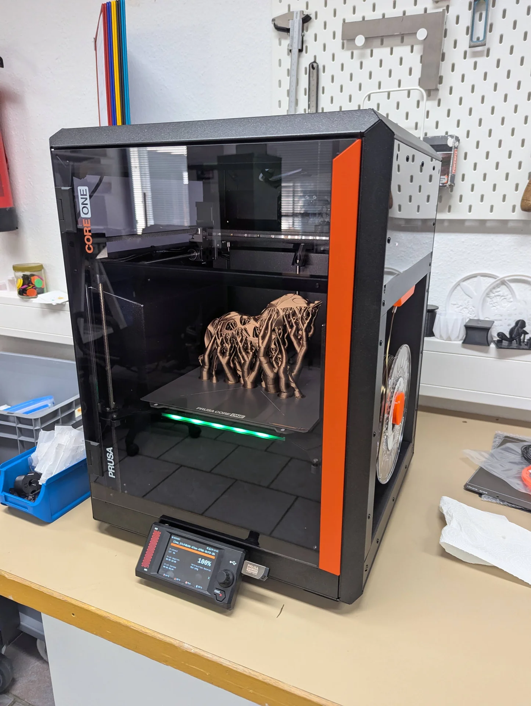
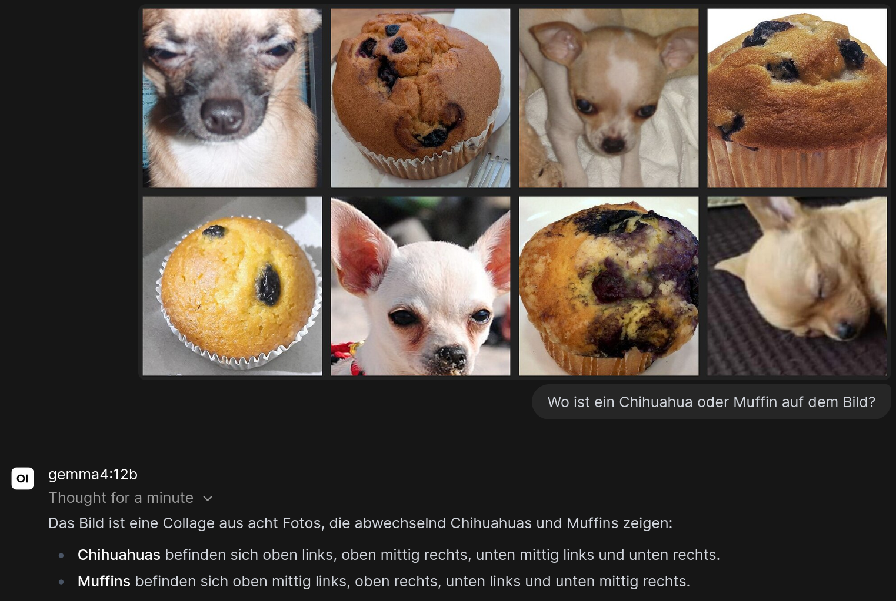
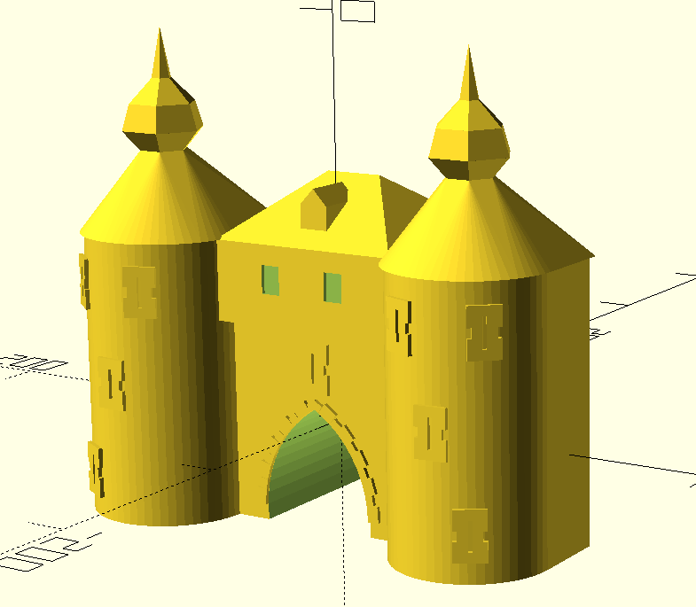
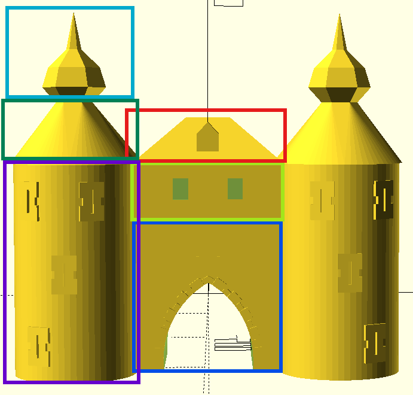
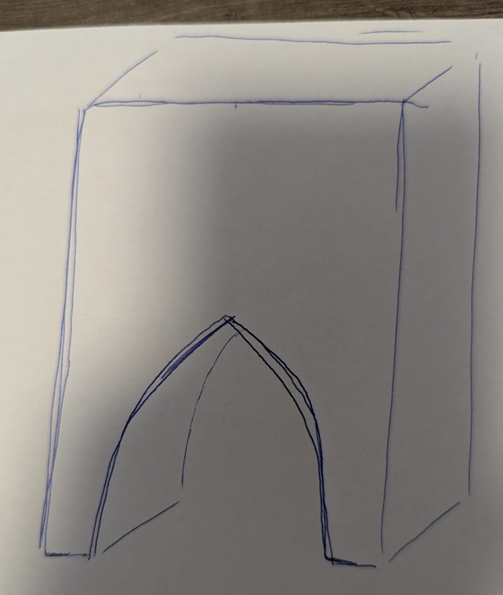
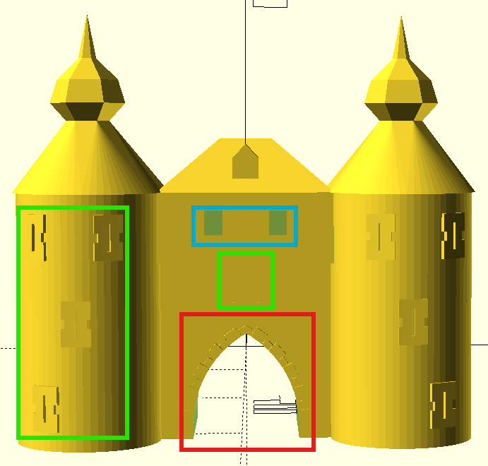
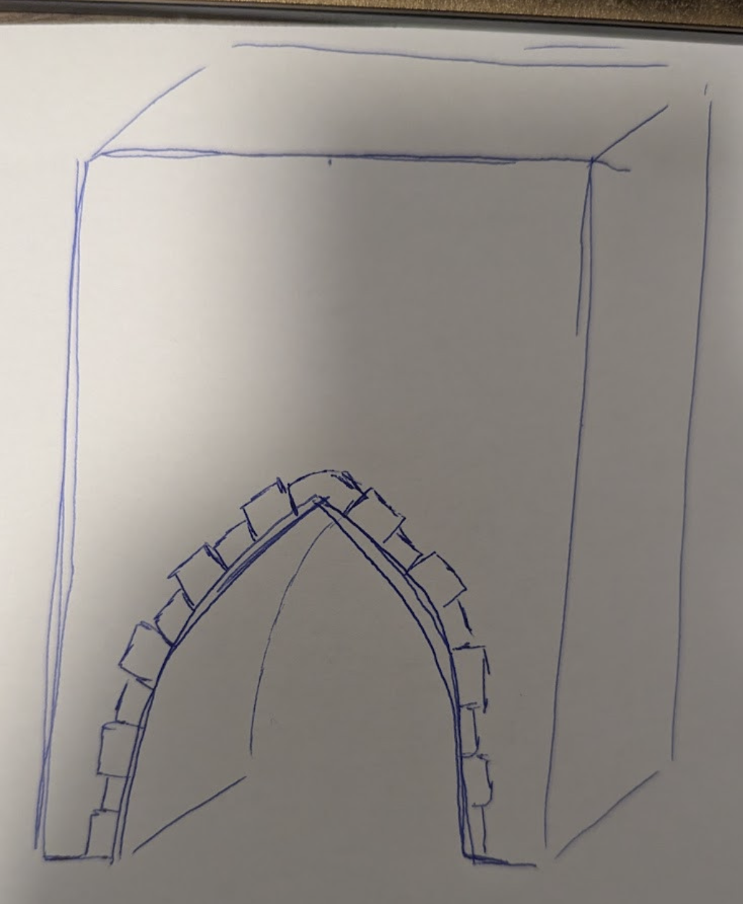

<!-- Die Präsentation ist Online unter https://presentations.erfindergeist.org/ki2/ zu finden -->

<!-- Der Veranstalter: Erfindergeist Jülich e.V. stellt sich kurz vor -->
# Vorstellung Erfindergeist Jülich e.V

* Gemeinnütziger Verein mit Sitz in Jülich, gegründet 2021
* **Ziel**: Förderung von Kreativität und Innovation durch praktisches Lernen und Zusammenarbeit
* Angebote
  * Workshops und Kreativ-Tage (Robotik-, Künstliche Intelligenz-, Podcast-Workshops, etc.)
  * Repair Cafe
  * Offene Werkstatt (3D-Drucker, Lasergravur, Holzverarbeitung, Textilveredelung, etc.)

::: {.notes}
Kurz den Verein vorstellen. Hinweis auf die Offene Werkstatt – der 3D-Drucker ist später der rote Faden des Workshops.
:::


## Offene Werkstatt: 3D-Druck

::: columns
::: {.column width="55%"}
- 3D-Drucker baut Objekte **Schicht für Schicht** aus Kunststoff
- Aus einer Datei am Computer wird ein echtes Objekt
- Ideal für Ersatzteile, Prototypen, Halterungen, Modelle
- Bei uns: **Prusa Core One** in der Offenen Werkstatt
:::
::: {.column width="45%"}
{fig-align="center" height="500"}
:::
:::

::: {.notes}
Das Foto zeigt den Prusa Core One der Offenen Werkstatt. Frage ans Publikum: Wer hat schon einmal etwas 3D-gedruckt?
:::

## Vom Modell zum Druck

1. **3D-Modell** erstellen (z.B. als STL-Datei)
2. **Slicer** zerlegt das Modell in Schichten (z.B. PrusaSlicer)
3. **Drucker** druckt Schicht für Schicht

**Heute im Fokus:** Wie KI beim ersten Schritt hilft — dem 3D-Modell.

::: {.notes}
Die größte Hürde für Einsteiger ist meist nicht der Drucker, sondern das 3D-Modell: Klassische CAD-Programme brauchen viel Einarbeitung. Genau hier setzt der Hauptteil des Workshops an – 3D-Modelle mit Hilfe von KI erstellen.

STL = verbreitetes Dateiformat für 3D-Modelle (beschreibt die Oberfläche als Dreiecke).
:::

## Spenden


::: columns
::: {.column width="70%"}

- Erfindergeist Jülich e.V. finanziert sich ausschließlich durch Mitgliedsbeiträge und Spenden. Wir Danken allen Unterstützern, die unsere Arbeit ermöglichen!

- Spenden Konto und PayPal auf unserer Webseite [https://linktree.erfindergeist.org/](https://linktree.erfindergeist.org/)

:::
::: {.column width="30%"}

{width="100%"}

:::
:::

::: {.notes}
Kurz auf Spendenmöglichkeiten hinweisen – nicht zu lange verweilen, am Ende kommt die Folie noch einmal.
:::

# Was ist KI?

- **Künstliche Intelligenz (KI)** bezeichnet Computersysteme, die menschliche Fähigkeiten wie Lernen, Denken oder Entscheiden nachahmen. Indem es Mathematische Modelle und Algorithmen verwendet, kann KI Muster erkennen, Vorhersagen treffen und Probleme lösen.


- **Large Language Models (LLM)** sind eine spezielle Form der KI, trainiert auf riesigen Textmengen — sie verstehen und erzeugen Sprache, beantworten Fragen und helfen bei der Analyse von Informationen.

::: {.notes}
Einstieg: KI ist ein Oberbegriff. LLMs sind nur ein Teil davon – aber der Teil, um den es heute hauptsächlich geht.
:::

## Was sind LLM

**Large Language Models (LLM)** sind KI-Modelle, die auf riesigen Textmengen trainiert wurden. Sie verstehen und erzeugen Sprache, beantworten Fragen und helfen bei der Analyse von Informationen.

Beispiel: ChatGPT, Claude, Copilot, Qwen, Gemini, Deepseek

Zu beachten ist das Dienste wie ChatGPT, Copilot oder Gemini auf LLMs basieren, aber nicht die LLMs selbst sind. Sie sind Anwendungen, die auf den Modellen aufbauen.

::: {.notes}
Wichtig ist die Unterscheidung Modell vs. Anwendung: ChatGPT ist die Anwendung, GPT das Modell dahinter. Das wird später bei den Eingabemöglichkeiten wieder wichtig.
:::

## Arten von LLMs

::: columns
::: {.column width="50%"}
### Text-Modelle

- Eingabe: nur Text
- Ausgabe: Text
- z.B. Llama 3, DeepSeek-R1
:::
::: {.column width="50%"}
### Multimodale Modelle

- Eingabe: Text, **Bilder**, teils Audio
- „Sehen“ Fotos, Screenshots, Diagramme, Handschrift
- z.B. GPT, Claude, Gemini, Gemma 3
:::
:::

::: aside
Multimodal = mehrere Modalitäten, also Arten von Eingaben wie Text, Bild oder Ton.
:::

::: {.notes}
Multimodale Modelle verarbeiten Bilder selbst: Ein Bild wird in kleine Bildausschnitte zerlegt und in Token umgewandelt – ähnlich wie Text. Dafür ist kein externes Werkzeug wie Texterkennung (OCR) nötig. Bilder verbrauchen dabei ebenfalls Token im Kontextfenster.

Text-Modelle können mit einem Bild nichts anfangen. Viele Modelle gibt es in beiden Varianten, z.B. Qwen (Text) und Qwen-VL (Vision-Language).
:::


## Beispiel: Multimodale Modelle

{fig-align="center" height="420"}

Chihuahua oder Muffin? Bild hochladen und die KI fragen.

::: {.notes}
Live-Demo: Bild in ein multimodales Modell hochladen (z.B. Gemma 3 in Open WebUI oder ChatGPT) und fragen: „Welche Bilder zeigen einen Hund, welche einen Muffin?“

Auflösung (Reihe für Reihe, von links): Hund, Muffin, Hund, Muffin – Muffin, Hund, Muffin, Hund.
:::

## Ergebnis: Chihuahua Muffin

{fig-align="center" height="520"}

::: {.notes}
Ergebnis des lokalen Modells besprechen: Was wurde richtig erkannt, wo lag es daneben?
:::

## Spezielle Coding-LLMs

Sprachmodelle, die besonders viel **Programmcode** gelernt haben.

- Schreiben und erklären Code
- Vervollständigen Code beim Tippen
- Können Programme selbst testen und Fehler beheben

**Beispiele:** Claude Code, Qwen-Coder, Kimi K3


::: {.notes}
Coding-Modelle sind normale LLMs, die zusätzlich mit großen Mengen Quellcode trainiert wurden. Dadurch beherrschen sie Syntax und typische Muster vieler Sprachen besser.

„Ergänzen mitten in einer Datei“ (Fill-in-the-Middle): Das Modell sieht Code vor und nach der Cursorposition und füllt die Lücke – die Grundlage für Autovervollständigung im Editor.

Werkzeuge: Moderne Coding-Modelle sind darauf trainiert, selbstständig Dateien zu lesen, zu bearbeiten und Befehle (z.B. Tests) auszuführen. Das nutzen Coding-Agenten wie OpenCode oder Claude Code – dazu später mehr.

Große Allround-Modelle wie Claude oder GPT sind ebenfalls sehr gut im Programmieren. Spezielle Coding-Modelle lohnen sich vor allem lokal, weil ein kleineres Spezialmodell auf eigener Hardware läuft und beim Code trotzdem gute Ergebnisse liefert.
:::

## Andere Arten von KI

- **Bilderkennung (Computer Vision):** KI erkennt und interpretiert Bilder und Videos, z.B. für Gesichtserkennung oder medizinische Bildanalyse.

- **Spracherkennung (Speech Recognition):** KI wandelt gesprochene Sprache in Text um, z.B. für virtuelle Assistenten oder Transkriptionen.

- **Informationsextraktion (Information Extraction):** KI analysiert Texte, um relevante Informationen zu extrahieren, z.B. für Datenbanken oder Zusammenfassungen. 

::: {.notes}
Nicht jede KI ist ein Sprachmodell. Viele Anwendungen im Alltag (Gesichtserkennung im Handy, Diktierfunktion) nutzen spezialisierte Modelle.
:::

## Was ist KI?: Was ist KI nicht

**Experiment** auf [chatgpt.com](https://chatgpt.com/):

::: {.chat-input}
Nenne mir eine zufällige Zahl.
:::

::: {.fragment}
KI ist **kein Zufallsgenerator**: Sie sagt das **wahrscheinlichste** nächste Wort voraus. Meistens 73, weil diese Zahl in den Trainingsdaten oft vorkommt.
:::

::: {.notes}
KI generiert Antworten, indem sie die wahrscheinlichsten nächsten Wörter vorhersagt – basierend auf den Mustern aus den Trainingsdaten. Die Antwort ist daher nicht wirklich zufällig, sondern eine Zahl, die in den Trainingsdaten häufig vorkommt oder als wahrscheinlich gilt. Es könnte z.B. sein, dass die Zahl 73 oft in den Daten vorkommt.

Tipp: Mehrere Teilnehmer gleichzeitig fragen lassen und die Antworten vergleichen.
:::

# Token

<!-- Ziel ist es aufzuzeigen wo die unterscheide zwischen Tokens in der Cloud und Lokal liegen. Am ende muss jeder Teilnehmer die Unterschiede verstehen. Die Tiefe sollte sich auf Parameter und Präzision beschränken-->

- Token sind die kleinsten Texteinheiten, in die ein KI-Modell Text zerlegt.

- Jedes Wort und Satzzeichen zählt meist als 1 Token. Leerzeichen werden typischerweise dem nächsten Token vorangestellt, nicht als eigenes Token gezählt.

- Ein Token ist nicht immer ein ganzes Wort. Das Wort „Apfel” ist vielleicht ein Token, „Verständnisfragen” hingegen werden in mehrere Tokens zerlegt.

::: {.notes}
Ziel der Section: verstehen, wie die KI Text „sieht“, und warum lokale Modelle kleiner sind als Cloud-Modelle.
:::


## Token: Beispiele

- Beispiel: „Hallo Welt!” → 3 Token („Hallo”, „ Welt”, „!”).

- Faustregel: 100 Token entsprechen etwa 75 Wörtern.

- Interaktiv ausprobieren: [platform.openai.com/tokenizer](https://platform.openai.com/tokenizer)

::: {.notes}
Live: Den Tokenizer öffnen und einen deutschen und einen englischen Satz vergleichen – deutsche Texte brauchen oft mehr Token.
:::


## Token: Was sind Parameter?

Wer KI lokal betreiben will, muss verstehen: wie viel RAM braucht ein Modell? Das hängt direkt von den Parametern ab.

- Parameter sind die gelernten Zahlenwerte eines Modells. Ein **7B-Modell** enthält **7.000.000.000 solcher Zahlen** — sie bestimmen gemeinsam, wie das Modell auf Eingaben reagiert.

- Je mehr Parameter, desto leistungsfähiger — aber auch desto mehr RAM wird benötigt.

::: {.notes}
Bild: Parameter sind wie Stellschrauben, die beim Training eingestellt wurden. Mehr Stellschrauben = mehr Wissen und Fähigkeiten, aber auch mehr Speicherbedarf.
:::

## Token: Präzision und RAM-Bedarf

**Präzision** = wie viele Bits eine Zahl im Modell belegt. Weniger Bits = weniger RAM.

| Modell | 16 Bit (FP16) | 4 Bit (Q4) |
|---|---|---|
| 3B | ~6 GB | ~2 GB |
| 7B | ~14 GB | ~4–5 GB |
| 13B | ~26 GB | ~8 GB |
| 70B | ~140 GB | ~40 GB |

: {tbl-colwidths="[30,35,35]"}

Ollama nutzt meist 4 Bit: **25 % des RAM**, kaum merklicher Qualitätsverlust.

::: {.notes}
FP16 = 16 Bit = 2 Byte pro Parameter. Ein 7B-Modell braucht also 7 Mrd. × 2 Byte ≈ 14 GB.

Quantisierung (Q4) speichert jede Zahl mit nur 4 Bit. Der RAM-Bedarf sinkt auf etwa ein Viertel. Die Werte sind Richtwerte – dazu kommt noch Speicher für das Kontextfenster.
:::

## Token: Tokens pro Sekunde

- **Tokens pro Sekunde (TPS)** misst die Geschwindigkeit: wie viele Token das Modell pro Sekunde ausgibt.

- Beispiel: eine Nvidia RTX 4090 (24 GB VRAM) erreicht mit Ollama typischerweise:
  - ~80–120 TPS für ein 7B-Modell (Q4) — flüssig lesbar
  - ~40–60 TPS für ein 13B-Modell (Q4) — ebenfalls flüssig
  - 70B-Modelle (Q4 ~40 GB) passen nicht mehr in den VRAM einer einzelnen Karte

::: aside
Richtwerte, Stand: Oktober 2026 — abhängig von Modell, Version und Einstellungen.
:::

::: {.notes}
Zum Vergleich: Menschen lesen etwa 5–10 Token pro Sekunde. Alles darüber wirkt flüssig.
:::

## Token: Was sagt uns das nun?

| | **Cloud** | **Lokal** |
|---|---|---|
| Modellgröße | sehr groß (oft nicht veröffentlicht) | 7B–13B Parameter (quantisiert) |
| Geschwindigkeit | hängt vom Anbieter ab | hängt von eigener Hardware ab (TPS) |
| Kontextfenster | bis ca. 1 Mio. Token | 4K–128K Token |
| Daten | verlassen den eigenen Rechner | bleiben auf dem eigenen Rechner |
| Kosten | laufend (Abo oder pro Token) | einmalig (Hardware) + Strom |

: {tbl-colwidths="[22,39,39]"}

::: {.notes}
Kernaussage: Lokal heißt kleinere Modelle, dafür bleiben die Daten auf dem eigenen Rechner. Cloud heißt größere Modelle, dafür verlassen die Daten den Rechner. Diese Abwägung zieht sich durch den ganzen Workshop.
:::

# Prompting

- Ziel: Prompting verstehen und optimieren

::: {.notes}
Ziel der Section: Die Qualität der Antwort hängt stark von der Frage ab.
:::

## Prompting: Was ist ein Prompt?

- **System prompt:** definiert die Rolle des Modells und den Kontext der Aufgabe. Beispiel: *„Du bist ein hilfsbereiter Assistent, der komplexe Themen einfach erklärt."*

- **User prompt:** enthält die eigentliche Frage oder Aufgabe, die das Modell beantworten soll. Beispiel: *„Erkläre mir den Unterschied zwischen KI und Machine Learning."*

:::aside
**Merke:** System prompts sind oft unsichtbar für den Benutzer, während user prompts direkt eingegeben werden. Beide zusammen bilden die Grundlage für die Interaktion mit dem Modell.
:::

::: {.notes}
Der System-Prompt ist bei ChatGPT & Co. unsichtbar vorgegeben. In Open WebUI kann man ihn selbst festlegen – das kann man kurz zeigen.
:::

## Prompting: SAND Methode

::: {.plain-table}
|   |   |
|---|---|
| **Situation** | Rolle KI-, Zielgruppe und Hintergrund definieren (Context wie z.B. E-Mail, Webseite, PDF, Bild etc. hinzufügen) |
| **Aufgabe** | Was soll die KI tun? (z.B. Text generieren, Code schreiben, Bild erstellen) |
| **Nebenbedingungen** | Regeln, Einschränkungen, (z.B. Beispiele anfügen) |
| **Darstellung** | Ausgabe Format (z.B. als Liste, Tabelle, Fließtext) |

: {tbl-colwidths="[30,70]"}
:::

::: {.notes}
SAND ist eine Eselsbrücke. Nicht jeder Prompt braucht alle vier Teile – aber je wichtiger das Ergebnis, desto mehr lohnt es sich.
:::

## Prompting: Beispiel ohne SAND

::: {.prompt-box .prompt-weak}
Schreib eine Einladung zum KI-Workshop.
:::

::: {.fragment}
Die KI muss raten:

- Wer schreibt, an wen?
- Was genau soll drinstehen?
- Wie lang, welcher Ton?
- Als E-Mail, Plakat oder Social-Media-Post?
:::

::: {.notes}
Erst das Publikum fragen, was an diesem Prompt fehlt, dann die Fragen per Klick einblenden.
:::

## Prompting: Beispiel mit SAND

::: {.prompt-box}
::: {.fragment}
[S]{.sand-letter} Schreibe für einen MINT-Verein. Die Leser sind interessierte Laien ohne Vorwissen. (anhang: PDF des Workshops mit allen fakten)
:::
::: {.fragment}
[A]{.sand-letter} Schreibe eine Einladung zu unserem nächsten KI-Workshop.
:::
::: {.fragment}
[N]{.sand-letter} Maximal 120 Wörter, freundlich, Sie-Form, keine Fachbegriffe.
:::
::: {.fragment}
[D]{.sand-letter} Als E-Mail mit Betreffzeile und drei Stichpunkten zum Ablauf.
:::
:::

::: {.notes}
Die vier Teile erscheinen nacheinander. Bei jedem Schritt kurz zurück auf die Fragen der vorherigen Folie verweisen: Jede SAND-Zeile beantwortet eine Frage, die die KI sonst hätte raten müssen.

Idealerweise live vorführen: erst den kurzen Prompt, dann den SAND-Prompt in dieselbe KI eingeben und die Ergebnisse vergleichen.
:::

## Prompting: Chat-Umgebung

Jede Chat-Umgebung weiß unterschiedlich viel über den Nutzer.

::: columns
::: {.column width="50%"}
### **Mit Gedächtnis**

- Merkt sich Vorlieben und Fakten
- Kennt frühere Chats, Dateien, E-Mails
- z.B. ChatGPT mit Memory, M365 Copilot
:::
::: {.column width="50%"}
### **Ohne Gedächtnis**

- Jeder Chat beginnt bei null
- Weiß nur, was im Prompt steht
- z.B. API, einfache Chat-Oberflächen
:::
:::

::: {.notes}
Fachbegriffe: zustandsbehaftet (stateful) vs. zustandslos (stateless). Das Sprachmodell selbst merkt sich nie etwas – das Gedächtnis kommt von der Anwendung, die im Hintergrund Informationen in den Prompt einfügt.
:::

## Prompting: Kontextfenster

- Das **Arbeitsgedächtnis** des Modells
- Gemessen in **Token** (Textbausteine)
- Alles muss hineinpassen: Prompt, Anhänge, Chatverlauf und Antwort
- Ist das Fenster voll, wird der Anfang des Chats „vergessen“

::: aside
**Merke:** Viel Kontext ist gut, aber nur so viel, wie hineinpasst.
:::

::: {.notes}
Bild: Das Kontextfenster ist wie ein Schreibtisch. Was nicht mehr draufpasst, fällt herunter – meist das Älteste zuerst.
:::

## Prompting: Wie groß ist ein Kontextfenster?

| Kontextfenster | entspricht ca. | typisch für |
|---|---|---|
| 4.000 Token | 6 Seiten | lokale Modelle (Voreinstellung Ollama) |
| 128.000 Token | 180 Seiten | viele offene Modelle (z.B. Llama, Qwen) |
| 1.000.000 Token | 1.400 Seiten | große Cloud-Modelle (z.B. Gemini, Claude) |

: {tbl-colwidths="[30,25,45]"}

::: aside
**Faustregel:** 1 Seite deutscher Text ≈ 700 Token. Stand: Oktober 2026, Werte ändern sich schnell.
:::

::: {.notes}
Lokale Werkzeuge wie Ollama stellen das Kontextfenster oft klein ein, um Arbeitsspeicher zu sparen. Ein großes Kontextfenster braucht deutlich mehr RAM bzw. VRAM.

Auch bei großen Fenstern gilt: Je voller, desto eher übersieht das Modell Details in der Mitte.
:::

## Prompting: Antworten (1/2)

### **Nichtdeterminismus**

Gleicher Prompt, unterschiedliche Antworten.

[Das Modell berechnet Wahrscheinlichkeiten für die nächsten Wörter – dabei fließen zufällige Elemente ein.]{style="color:#aaaaaa"}

### **Halluzination**

Das Modell erfindet Fakten, die nicht korrekt sind.

[Es erzeugt eine plausible Antwort, auch wenn es keine verlässlichen Informationen hat.]{style="color:#aaaaaa"}

::: {.notes}
Nichtdeterminismus: Live denselben Prompt zweimal abschicken und die Antworten vergleichen.

Halluzination: Das Modell erzeugt eine plausible Antwort, auch wenn es keine verlässlichen Informationen hat.
:::


## Prompting: Antworten (2/2)

### **Bias**

Vorurteile und Verzerrungen aus den Trainingsdaten.

[Sind die Trainingsdaten nicht ausgewogen, werden Antworten einseitig oder unfair.]{style="color:#aaaaaa"}

### **Overreliance**

Zu viel Vertrauen in die KI.

[Eigene Fähigkeiten und kritisches Denken werden vernachlässigt.]{style="color:#aaaaaa"}

::: aside
**Merke:** Antworten der KI immer hinterfragen und überprüfen.
:::

::: {.notes}
Bias: Vorurteile aus den Trainingsdaten werden übernommen.

Overreliance: Gerade bei Code und Fakten gilt – Ergebnis immer prüfen, bevor man es verwendet.
:::

# Eingabemöglichkeiten

Wie und wo kann man mit KI arbeiten?

::: {.notes}
Überleitung: Wir wissen jetzt, wie KI funktioniert und wie man gut fragt. Jetzt geht es darum, wo und wie man KI konkret benutzt.
:::


## Eingabemöglichkeiten: Übersicht

| Art | Lokal | Cloud |
|---|---|---|
| Chat im Browser (Web-UI) | Open WebUI | ChatGPT, Claude.ai, Gemini |
| Terminal / Agent (CLI) | OpenCode | Claude Code |
| Im Editor (IDE) | VS Code + Continue | GitHub Copilot |

: {tbl-colwidths="[30,30,40]"}

Das Sprachmodell ist austauschbar — die Oberfläche bestimmt, **was die KI tun darf**.

::: {.notes}
Dasselbe Modell kann in verschiedenen Oberflächen laufen. Im Chat antwortet die KI nur mit Text. Als Agent im Terminal oder Editor darf sie zusätzlich Dateien anlegen, ändern und Befehle ausführen.

Lokal heißt: Modell läuft über Ollama auf dem eigenen Rechner. Cloud heißt: Modell läuft beim Anbieter.
:::

## Web-GUI mit Tools

- **Web-GUI:** die Chat-Oberfläche im Browser, z.B. ChatGPT oder Open WebUI
- **Tools:** Werkzeuge, die die KI bei Bedarf selbst aufruft

Typische Tools: Websuche, Rechnen, Dateien lesen, Bilder erzeugen

**Ablauf:** Frage → KI wählt Tool → Anwendung führt es aus → KI antwortet mit dem Ergebnis

::: {.notes}
Das Sprachmodell allein kann nur Text lesen und schreiben. Es kann nicht ins Internet schauen, nicht zuverlässig rechnen und keine Dateien öffnen.

Die Web-GUI (Graphical User Interface = grafische Oberfläche) ist die Anwendung rund um das Modell. Sie stellt dem Modell Tools zur Verfügung. Das Modell entscheidet selbst, wann es ein Tool braucht, z.B. „Für diese Frage brauche ich aktuelle Infos → Websuche“. Die Anwendung führt die Suche aus und gibt das Ergebnis an das Modell zurück, das daraus die Antwort formuliert.

Beispiel: „Wie wird das Wetter morgen in Jülich?“ – ohne Websuche kann das Modell das nicht wissen.
:::


## Lokal: Ollama und Open WebUI

- **Ollama:** startet Sprachmodelle auf dem eigenen Rechner
- Modelle per Befehl herunterladen, z.B. `ollama run gemma3`
- **Open WebUI:** Chat-Oberfläche im Browser, ähnlich wie ChatGPT
- Verbindet sich mit Ollama — alle Daten bleiben lokal
- Dokumente hochladen, mehrere Modelle vergleichen

::: {.notes}
Ollama ist der „Motor“: Es lädt und betreibt die Modelle. Open WebUI ist das „Armaturenbrett“: eine Weboberfläche, über die man mit den Modellen chattet.

Live-Demo: In Open WebUI ein lokales Modell auswählen und eine Frage stellen. Ggf. die Geschwindigkeit (Tokens pro Sekunde) zeigen – Bezug zur Section Token.
:::

## Im Terminal: Coding-Agenten

- **Agent:** KI, die selbstständig mehrere Schritte erledigt
- Liest und schreibt Dateien, führt Befehle aus, testet
- **OpenCode:** Open Source, auch mit lokalen Modellen über Ollama
- **Claude Code:** von Anthropic, nutzt Claude-Modelle in der Cloud

::: {.notes}
Im Chat bekommt man Code als Text und muss ihn selbst kopieren und speichern. Ein Coding-Agent arbeitet direkt im Projektordner: Er legt Dateien an, ändert sie, startet Programme und reagiert auf Fehlermeldungen.

OpenCode und Claude Code funktionieren ähnlich. Der Unterschied liegt vor allem im Modell: OpenCode kann lokale Modelle nutzen, Claude Code nutzt die Claude-Modelle von Anthropic.

Beide werden später im 3D-Teil für OpenSCAD genutzt.
:::

## Im Editor (IDE)

- **IDE:** Programm zum Schreiben von Code, z.B. VS Code
- KI schlägt beim Tippen Code vor
- Chat-Fenster direkt neben dem Code
- **Cloud:** GitHub Copilot · **Lokal:** z.B. Continue + Ollama

::: {.notes}
IDE = Integrated Development Environment (Entwicklungsumgebung). Die KI sieht den Code, der gerade offen ist, und kann Vorschläge passend zum Projekt machen.

Auch Claude Code und OpenCode lassen sich in VS Code einbinden – die Grenzen zwischen CLI und IDE verschwimmen.
:::

## Live Coding Snake

::: {.chat-input}
Baue ein kleines Snake-Spiel, welches direkt im Browser läuft.
:::

::: {.notes}
Live-Demo: Denselben Prompt einmal im Web-UI (Open WebUI oder ChatGPT) und einmal im Coding-Agenten (OpenCode oder Claude Code) eingeben.

Web-UI: Code erscheint als Text im Chat und muss kopiert und gespeichert werden. Agent: Die Datei wird direkt angelegt und kann sofort geöffnet werden.
:::

## Ergebnis: Snake {background-color="#2c3e50"}

```{=html}
<iframe src="demo-snake.html"
  style="width:100%;height:85vh;border:none;background:#2c3e50;">
</iframe>
```

::: {.notes}
Das Spiel live ausprobieren. Hinweis: Dieser Code wurde vollständig von der KI geschrieben.
:::

## Code ist Text

LLMs schreiben Text — und **Code ist auch nur Text**.

- Webseiten und Spiele (HTML, JavaScript)
- Präsentationen (diese hier ist mit Quarto geschrieben)
- **3D-Modelle** (OpenSCAD)

**Merke:** Alles, was man als Code beschreiben kann, kann KI gut.

::: {.notes}
Überleitung zum Hauptteil: Wenn KI ein Spiel programmieren kann, kann sie auch ein 3D-Modell programmieren. Genau das macht OpenSCAD möglich.
:::

# 3D-Generierung mit KI

Zwei Wege zum 3D-Modell:

::: columns
::: {.column width="50%"}
### Weg 1: Text → Code → 3D

- KI schreibt OpenSCAD-Code
- Präzise Maße, jederzeit änderbar
:::
::: {.column width="50%"}
### Weg 2: Bild → 3D

- KI erzeugt aus einem Bild ein 3D-Modell
- Organische Formen, Figuren
:::
:::

Beide Wege gibt es **lokal** und in der **Cloud**.

::: {.notes}
Hauptteil des Workshops. Zwei grundverschiedene Ansätze: Bei Weg 1 schreibt die KI Code, bei Weg 2 erzeugt sie direkt eine 3D-Form.
:::

# Weg 1: Text → Code → 3D

**OpenSCAD** ist eine Programmiersprache für 3D-Modelle — statt mit der Maus zu modellieren, beschreibt man das Modell als Code.

**Das Prinzip:** Prompt an Claude Code → SCAD-Code → fertiges 3D-Modell

Beispiel: Der **Hexenturm Jülich** — ein historisches Wahrzeichen, nachgebaut aus Code.

::: {.notes}
Hier kommt alles zusammen: Coding-Agent (Eingabemöglichkeiten) + gute Prompts (SAND) + Code ist Text.
:::

## OpenSCAD: Was ist OpenSCAD?

::: columns
::: {.column width="60%"}
- OpenSCAD beschreibt 3D-Objekte als **parametrischen Code**
- Grundformen wie Zylinder, Quader und Kugeln werden kombiniert, subtrahiert und transformiert
- Parameterisierung ermöglicht einfache Änderung auch ohne Kenntnisse
- Ideal für technische und architektonische Modelle
:::
::: {.column width="40%"}
```
// Beispiel: einfacher Turm mit Kuppel
cylinder(h=50, r=10);
translate([0,0,50])
  sphere(r=5);

```


```

// Beispiel: parameter
// Breite
roof_w       = 100;  
//Tiefe
roof_d       = 90;
... 
```
:::
:::

::: {.notes}
OpenSCAD ist kostenlos und Open Source. Parameter oben in der Datei (z.B. Breite, Höhe) kann man später ändern, ohne den restlichen Code zu verstehen.
:::

## OpenSCAD: KI als Programmierpartner

**Wie Claude Code beim Modellieren hilft:**

1. Beschreibung des gewünschten Objekts in natürlicher Sprache
2. Claude Code generiert den OpenSCAD-Code
3. Modell wird geprüft und verfeinert — durch weitere Prompts
4. Iterativer Prozess: Feedback → Anpassung → Verbesserung

::: {.notes}
Wichtig ist der iterative Ablauf: nicht alles in einem Prompt, sondern Schritt für Schritt.
:::

## OpenSCAD: Beispiel

> *"Erstelle einen zylindrischen Turm mit konischem Dach und einer spitzen Turmspitze"*

**Merke:** KI ersetzt keine CAD-Kenntnisse — sie macht den Einstieg deutlich einfacher.

::: {.notes}
Der erste Prompt ist bewusst einfach. Details kommen in weiteren Prompts.
:::

## OpenSCAD: Ergebnis — Hexenturm Jülich


::: columns
::: {.column width="60%"}

{fig-align="center" height="500"}

:::
::: {.column width="40%"}

Der fertige Hexenturm — vollständig aus OpenSCAD-Code generiert, mit Hilfe von Claude Code.
:::
:::

::: {.notes}
Der Hexenturm ist ein Wahrzeichen von Jülich. Das Modell entstand in mehreren Schritten mit Claude Code.
:::

## OpenSCAD: Modularer Aufbau

{fig-align="center" height="500"}

::: aside
Das Modell besteht aus einzelnen Modulen: Turmspitze, Kegelhelm, Turmschaft, Mittelgebäude und Toreinfahrt — jedes separat im Code definiert und kombiniert.
:::

::: {.notes}
Wie beim Prompting gilt: große Aufgaben in kleine Teile zerlegen. Jedes Modul wurde einzeln erstellt und dann zusammengesetzt.
:::

## OpenSCAD: Modularer Aufbau prompts

::: columns
::: {.column width="45%"}

> *" Erstelle ein Rechteck wo ein Tunnel durchgeht. anbei ein Bild wie ich es mir vorstelle. Generiere Parameter für x,y,z sowie breite und höhe des quaders und Tunnels. zentriere das Objekt."*

:::
::: {.column width="55%"}

{fig-align="center" height="500"}


:::
:::

::: {.notes}
Eine Skizze im Prompt hilft enorm – multimodale Modelle können sie auswerten (Bezug zur Folie Chihuahua oder Muffin).
:::

## OpenSCAD: Details im Code

{fig-align="center" height="500"}

::: aside
Details wie Fensteröffnungen, Torbogen und Wandstruktur wurden später hinzugefügt.
:::

::: {.notes}
Details wurden erst ergänzt, als die Grundform stand.
:::

## OpenSCAD: Detail prompts

::: columns
::: {.column width="55%"}

> *"Entlang des Tunnels hätte ich gerne an nur einer Seite eine Verzierung. Und zwar sollen das Steine darstellen, die abwechselnd größer und kleiner werden. Oben mittig ist ein Spezialstein. Anbei ein Bild, wie ich es mir etwa vorstelle."*

:::
::: {.column width="45%"}

{fig-align="center" height="500"}


:::
:::

::: {.notes}
Auch hier: Text plus Bild. Die KI übersetzt die Skizze in Code.
:::

## OpenSCAD: Lokal mit OpenCode

<!-- TODO: Gleichen Prompt wie beim Hexenturm mit OpenCode + lokalem Coding-Modell (z.B. Qwen3-Coder über Ollama) ausführen, Screenshot einfügen -->

- Gleicher Ablauf, aber mit **OpenCode** und einem **lokalen Coding-Modell**
- Keine Daten verlassen den Rechner, keine laufenden Kosten
- Ergebnis neben dem Claude-Ergebnis vergleichen

::: {.notes}
Hier ehrlich zeigen, wo das lokale Modell an Grenzen stößt: komplexere Geometrie, mehr Nachbesserungen nötig, langsamere Antworten. Bezug zur Section Token: kleineres Modell, weniger Parameter.
:::

# Weg 2: Bild → 3D

Aus einem Foto oder einer Zeichnung wird ein 3D-Modell.

- KI „errät“ auch die nicht sichtbaren Seiten
- Ergebnis: Oberfläche aus Dreiecken (Mesh), oft mit Farbe
- Gut für Figuren und organische Formen, weniger für exakte Maße

::: {.notes}
Im Gegensatz zu Weg 1 entsteht hier kein Code, sondern direkt eine Oberfläche aus vielen kleinen Dreiecken. Das ist gut für Figuren, aber Maße lassen sich nachträglich kaum ändern.
:::

## Lokal: ComfyUI + Hunyuan3D

<!-- TODO: Beispielbilder einfügen (Workflow-Screenshot + Ergebnis) -->

- **ComfyUI:** Oberfläche, in der man KI-Schritte als **Knoten** verbindet
- Ursprünglich für Bilder, inzwischen auch für 3D
- **Hunyuan3D** (Tencent): offenes Modell für Bild → 3D
- Läuft auf eigener Grafikkarte — braucht aber viel Grafikspeicher

::: {.notes}
ComfyUI ist ein Knoten-Editor: Jeder Kasten ist ein Arbeitsschritt (Bild laden, Modell laden, 3D erzeugen, speichern). Die Kästen werden mit Linien verbunden. Fertige Workflows lassen sich als Datei teilen.

Idee für eine Pipeline: Bild mit FLUX erzeugen → in Hunyuan3D zu 3D-Modell → als STL drucken.
:::

## Cloud: Meshy

<!-- TODO: Gezeichnetes Bild -> 3D-Modell Abbildung einfügen -->

- Webseite für Text → 3D und Bild → 3D
- Keine Installation, keine eigene Grafikkarte nötig
- Export u.a. als STL für den 3D-Druck
- Kostenloser Einstieg mit begrenztem Kontingent

::: aside
[meshy.ai](https://www.meshy.ai) — Stand: Oktober 2026, Preise und Kontingente ändern sich.
:::

::: {.notes}
Live-Demo: Eine einfache Zeichnung hochladen und das Ergebnis im Browser drehen.
:::

## Ohne Installation: Hunyuan3D auf HuggingFace

<!-- TODO: Space testen, Screenshot des Ergebnisses einfügen -->

- Hunyuan3D-2.1 als Demo direkt im Browser
- Bild hochladen → 3D-Modell herunterladen
- Gut zum Ausprobieren, bevor man lokal installiert

::: aside
[huggingface.co/spaces/tencent/Hunyuan3D-2.1](https://huggingface.co/spaces/tencent/Hunyuan3D-2.1) — Stand: Oktober 2026
:::

::: {.notes}
Die Demo läuft auf geteilter Hardware – bei vielen Nutzern kann es Wartezeiten geben.
:::

## Ohne Installation: Pixal3D

**Pixal3D** von Tencent ARC wandelt ein einzelnes Foto in ein vollständiges 3D-Modell um — mit Textur, direkt im Browser rotierbar.

Demo: [huggingface.co/spaces/TencentARC/Pixal3D](https://huggingface.co/spaces/TencentARC/Pixal3D)

::: {.notes}
Live-Demo: Ein Foto hochladen und das Ergebnis im Browser drehen.
:::

## Pixal3D: Wie funktioniert es?

::: columns
::: {.column width="60%"}
- Eingang: ein einzelnes Foto (Produkt, Gegenstand, Figur)
- Ausgang: vollständiges 3D-Modell mit Textur als `.glb`-Datei
- Basiert auf **Multi-View Diffusion** — das Modell ergänzt nicht sichtbare Seiten
- Ergebnis direkt im Browser rotierbar und herunterladbar
:::
::: {.column width="40%"}
| Eigenschaft | Wert |
|---|---|
| Typ | Image-to-3D |
| Eingang | 1 Foto |
| Ausgang | .glb / .obj |
| Laufzeit | ~30–90 s |

: {tbl-colwidths="[50,50]"}
:::
:::

::: {.notes}
Das Modell ergänzt nicht sichtbare Seiten – es „rät“, wie die Rückseite aussehen könnte. Bei ungewöhnlichen Objekten kann das schiefgehen.
:::

## Vergleich der Wege

| | **Weg 1: OpenSCAD + KI** | **Weg 2: Bild → 3D** |
|---|---|---|
| Eingabe | Text (und Skizzen) | Foto oder Zeichnung |
| Ergebnis | Code → exaktes Modell | Mesh (Dreiecksnetz) |
| Maße | präzise, als Parameter änderbar | ungefähr, muss skaliert werden |
| Stärke | technische Teile, Gebäude | Figuren, organische Formen |
| Lokal | OpenCode + Ollama | ComfyUI + Hunyuan3D |
| Cloud | Claude Code | Meshy |

: {tbl-colwidths="[18,41,41]"}

::: {.notes}
Faustregel: Muss es passen (Ersatzteil, Halterung)? → Weg 1. Soll es gut aussehen (Figur, Deko)? → Weg 2.
:::

# Vom Modell zum Druck

Das 3D-Modell ist fertig — wie wird daraus ein echtes Objekt?

::: {.notes}
Schließt den Kreis zur Vorstellung: Das Ziel ist ein echtes, gedrucktes Objekt.
:::

## Vom Modell zum Druck: Export

- **OpenSCAD:** Modell rendern und als **STL** exportieren
- **Meshy / Hunyuan3D:** oft GLB oder OBJ → bei Bedarf in STL umwandeln
- **Slicer** (z.B. PrusaSlicer) zerlegt das Modell in Schichten
- Ergebnis: Druckdatei für den 3D-Drucker

::: {.notes}
In OpenSCAD: F6 (rendern), dann Datei → Exportieren → STL. Slicer können meist STL, OBJ und 3MF direkt öffnen.
:::

## Vom Modell zum Druck: Typische Probleme

- **Größe:** Bild-zu-3D-Modelle haben keine echten Maße → im Slicer skalieren
- **Löcher im Mesh:** Oberfläche nicht geschlossen → reparieren
- **Zu dünne Wände:** brechen oder werden nicht gedruckt
- **Überhänge:** brauchen Stützmaterial
- Bei OpenSCAD-Modellen deutlich seltener

::: {.notes}
Viele Slicer reparieren kleine Mesh-Fehler automatisch. Für größere Probleme hilft z.B. Blender.
:::

## Vom Modell zum Druck: Selbst ausprobieren

<!-- TODO: Foto vom gedruckten Hexenturm einfügen (falls vorhanden) -->

::: columns
::: {.column width="55%"}
- 3D-Drucker in der **Offenen Werkstatt** des Erfindergeist Jülich e.V.
- Eigene KI-Modelle mitbringen und drucken
:::
::: {.column width="45%"}
{fig-align="center" height="350"}
:::
:::

::: {.notes}
Einladung aussprechen: Wer ein eigenes Modell erstellt hat, kann es in der Offenen Werkstatt drucken.
:::

# Zusammenfassung

::: {.notes}
Kurzer Rückblick, bevor die Fragerunde startet.
:::

## Der rote Faden

1. **Verstehen:** KI sagt das wahrscheinlichste nächste Token voraus
2. **Richtig fragen:** SAND-Methode, Kontext mitgeben
3. **Werkzeuge kennen:** Web-UI, Agent, Editor — lokal oder Cloud
4. **Etwas bauen:** Code ist Text → 3D-Modelle mit KI
5. **Drucken:** Vom Modell zum echten Objekt

::: {.notes}
Die fünf Schritte noch einmal in eigenen Worten zusammenfassen.
:::

## Das sollten Sie mitnehmen

- Antworten der KI immer hinterfragen und überprüfen
- Je weniger die KI weiß, desto mehr Kontext muss der Prompt liefern
- Lokal: Daten bleiben bei Ihnen · Cloud: größere Modelle
- Alles, was man als Code beschreiben kann, kann KI gut
- KI ersetzt keine Fachkenntnisse — sie macht den Einstieg einfacher

::: {.notes}
Die Merke-Sätze aus den einzelnen Sections.
:::

# Fragen & Diskussion

Haben Sie Fragen oder Anmerkungen?

::: {.notes}
Offene Runde. Danach je nach Zeit: Bonus-Teile.
:::

# Bonus: HuggingFace

**HuggingFace** ist die größte Plattform für offene KI-Modelle — vergleichbar mit GitHub, aber für KI.

Zum Abschluss vier Demos aus weiteren Bereichen: Bild, Video und Sprache.

::: {.notes}
Bonus je nach verfügbarer Zeit. Alle Demos laufen kostenlos im Browser.
:::

## HuggingFace: Die Plattform

- Über **1 Million Modelle** frei verfügbar: Sprache, Bild, Audio, Video
- **Spaces**: Interaktive Demos, direkt im Browser — keine Installation nötig
- Modelle von großen Laboren (Meta, Google, OpenAI) und Community-Entwicklern
- Mit einem **Pro-Account** lassen sich leistungsfähigere GPU-Ressourcen nutzen

::: aside
[huggingface.co](https://huggingface.co) — kostenlose Basisnutzung, Pro-Account für erweiterte Ressourcen
:::

::: {.notes}
Kurz die Startseite und einen Space zeigen.
:::

# HuggingFace: FLUX.1 — Text zu Bild

**FLUX.1 [schnell]** von **Black Forest Labs** erzeugt hochwertige Bilder aus Textbeschreibungen — in wenigen Sekunden.

> *„A red panda sitting on a rooftop at sunset, cinematic"* → fertiges Bild

Demo: [huggingface.co/spaces/black-forest-labs/FLUX.1-schnell](https://huggingface.co/spaces/black-forest-labs/FLUX.1-schnell)

::: {.notes}
Live-Demo mit dem Beispielprompt. Bezug zu Weg 2: Ein so erzeugtes Bild kann Vorlage für ein 3D-Modell sein.
:::

## HuggingFace: Was ist FLUX.1?

::: columns
::: {.column width="60%"}
- Entwickelt von **Black Forest Labs** — gegründet von den Autoren von Stable Diffusion
- **[schnell]** bedeutet: optimiert für Geschwindigkeit — 1–4 Schritte statt 20–50
- Qualität vergleichbar mit Midjourney oder DALL·E 3
- Architektur: **Diffusion** — Start aus Rauschen, schrittweise Verfeinerung
:::
::: {.column width="40%"}
| Eigenschaft | Wert |
|---|---|
| Typ | Text-to-Image |
| Schritte | 1–4 |
| Lizenz | Offen |
| Laufzeit | ~3–8 s/Bild |

: {tbl-colwidths="[50,50]"}
:::
:::

## HuggingFace: Wie funktioniert Text-to-Image?

**Diffusion — vereinfacht in drei Schritten:**

1. **Start**: Das Modell beginnt mit einem Bild aus purem Rauschen
2. **Entrauschen**: Schritt für Schritt wird das Rauschen reduziert — geleitet vom Text-Prompt
3. **Ergebnis**: Nach wenigen Schritten entsteht ein kohärentes Bild

FLUX.1 [schnell] erreicht gute Qualität schon in **4 Schritten** — klassische Modelle brauchen 20–50.

## HuggingFace: Tipps für gute Prompts

**Was funktioniert gut:**

- Stil nennen: *„watercolor painting", „photorealistic", „oil on canvas"*
- Licht beschreiben: *„golden hour", „soft studio lighting", „dramatic shadows"*
- Komposition angeben: *„close-up portrait", „wide angle", „bird's eye view"*

**Was FLUX.1 nicht zuverlässig kann:**

- Lesbaren Text im Bild erzeugen
- Exakte Personenähnlichkeit reproduzieren

# HuggingFace: Wan2.2 — Text zu Video

**Wan2.2** ist ein offenes Video-Generierungsmodell von **Wan-AI** — es erzeugt aus einer Textbeschreibung ein kurzes Video.

> *„A cat walking through a sunlit garden"* → fertiges Video

Demo: [huggingface.co/spaces/r3gm/wan2-2-fp8da-aoti-preview-2](https://huggingface.co/spaces/r3gm/wan2-2-fp8da-aoti-preview-2)

::: {.notes}
Live-Demo – die Erzeugung dauert etwas, ggf. vorher starten.
:::

## HuggingFace: Was ist Wan2.2?

::: columns
::: {.column width="60%"}
- Entwickelt von **Wan-AI** (wan.video), veröffentlicht als offenes Modell
- Modellgröße: **14 Milliarden Parameter**
- Aufgabe: **Text-to-Video** — aus einer Beschreibung wird ein kurzes Video synthetisiert
- Architektur: **Diffusion** — dasselbe Prinzip wie FLUX.1, aber für Videosequenzen
:::
::: {.column width="40%"}
| Eigenschaft | Wert |
|---|---|
| Parameter | 14B |
| Typ | Text-to-Video |
| Lizenz | Offen |
| Laufzeit | ~30–60 s/Video |

: {tbl-colwidths="[50,50]"}
:::
:::

## HuggingFace: FP8 — Warum läuft das im Browser?

Das Modell hat 14B Parameter — normalerweise **~28 GB RAM** nötig (FP16).

Die Demo-Version nutzt **FP8-Quantisierung** (8 Bit statt 16 Bit pro Zahl):

- RAM-Bedarf sinkt auf **~14 GB** — passt auf eine GPU-Instanz
- Qualitätsverlust kaum wahrnehmbar
- **AOTI** (Ahead-of-Time Compilation) beschleunigt die Inferenz zusätzlich

HuggingFace stellt kostenlose GPU-Rechenzeit bereit (*Running on Zero*) — daher kann jeder die Demo gratis nutzen.

# HuggingFace: Whisper — Sprache zu Text

**Whisper** von **OpenAI** wandelt gesprochene Sprache automatisch in Text um — in über 90 Sprachen.

Demo: Mikrofon aufnehmen oder Audio hochladen → Text erscheint automatisch.

Demo: [huggingface.co/spaces/hf-audio/whisper-large-v3](https://huggingface.co/spaces/hf-audio/whisper-large-v3)

::: {.notes}
Live-Demo: Einen Satz ins Mikrofon sprechen.
:::

## HuggingFace: Was kann Whisper?

::: columns
::: {.column width="60%"}
- **Spracherkennung** in über 90 Sprachen
- **Übersetzung**: direkt ins Englische ohne Zwischenschritt
- Funktioniert mit Mikrofon oder hochgeladenen Audio-Dateien
- Sehr robust gegenüber Dialekten, Akzenten und Hintergrundgeräuschen
:::
::: {.column width="40%"}
| Eigenschaft | Wert |
|---|---|
| Typ | Speech-to-Text |
| Sprachen | 90+ |
| Lizenz | Offen (MIT) |
| Laufzeit | Echtzeit |

: {tbl-colwidths="[50,50]"}
:::
:::

## HuggingFace: Wo wird Whisper eingesetzt?

- Automatische Untertitel für Videos
- Transkription von Meetings und Interviews
- Barrierefreiheit: Gesprochenes für Hörgeschädigte in Text umwandeln
- Basis für Sprachassistenten und Sprachsteuerung

Whisper ist das **„Ohr"** der KI — Kokoro TTS ist die **„Stimme"**.

# HuggingFace: Kokoro TTS — Text zu Sprache

**Kokoro** erzeugt aus geschriebenem Text natürlich klingende Sprache — die Umkehrung von Whisper.

> Whisper: Sprache → Text · Kokoro: Text → Sprache

Demo: [huggingface.co/spaces/hexgrad/Kokoro-TTS](https://huggingface.co/spaces/hexgrad/Kokoro-TTS)

::: {.notes}
Live-Demo: Einen deutschen Satz vorlesen lassen.
:::

## HuggingFace: Was kann Kokoro TTS?

::: columns
::: {.column width="60%"}
- Über **50 Stimmen** — verschiedene Altersgruppen, Akzente, Geschlechter
- Mehrsprachig: Englisch, Deutsch, Französisch, Japanisch u.v.m.
- Sehr natürlicher Klang — kaum von menschlicher Stimme zu unterscheiden
- Läuft vollständig im Browser, keine Installation nötig
:::
::: {.column width="40%"}
| Eigenschaft | Wert |
|---|---|
| Typ | Text-to-Speech |
| Stimmen | 50+ |
| Lizenz | Offen |
| Laufzeit | ~2–5 s |

: {tbl-colwidths="[50,50]"}
:::
:::

## HuggingFace: Whisper + Kokoro = Sprach-Pipeline

**Aus zwei Bausteinen wird ein vollständiger Sprachassistent:**

```
Mikrofon → [Whisper] → Text → [KI-Modell] → Text → [Kokoro] → Lautsprecher
```

- **Whisper**: Sprache → Text (Eingabe verstehen)
- **KI-Modell**: Text → Text (antworten)
- **Kokoro**: Text → Sprache (vorlesen)

So entstehen Sprachassistenten — aus frei verfügbaren, offenen Bausteinen.

# Bonus: Termine-Webseite

Eine mit KI erstellte Webseite: Sie zeigt die Termine des Vereins und erklärt, wie diese öffentlich bereitgestellt werden.

::: {.notes}
Praxisbeispiel aus dem Verein: Die Termine-Webseite wurde mit KI programmiert.
:::


## Plan erstellen

Der Plan ist das Herzstück, um die KI in die richtige Richtung zu lenken. Je genauer er ist, desto eher entsteht, was man sich vorstellt.

- Technologie einschränken
- Zielgruppe festlegen und inhaltliche Schwerpunkte setzen
- Alles in Bereiche aufteilen (Header, Footer, Inhaltsbereiche)
- CI festlegen (Farben, Schriften, Logo)
- Code-Qualität und Sicherheit festlegen

::: {.notes}
Der Plan entspricht der SAND-Methode im Großen: Situation, Aufgabe, Nebenbedingungen und Darstellung werden vorab festgelegt.
:::

## Reicht ein Plan?

Nein — auch ein guter Plan liefert selten sofort das perfekte Ergebnis.

- Ergebnis ansehen, dann **in kleinen Schritten** nachbessern
- Ein Prompt pro Änderung
- Beispiele auf den nächsten Folien: Herzanimation und Achievements

::: {.notes}
Überleitung zu den Prompt-Beispielen.
:::

## Prompt-Beispiel: Herzanimation 1/2

- Um der KI zu erklären, welche Animation gerne hätte, wurde auf eine example Seite verlinkt [gsap.com](https://gsap.com/community/forums/topic/28814-using-gsap-to-loop-a-pulsing-animation/) (fig. 1)
- folgend wurde gepromptet, dass die Animation mehr wie das eigentliche Herz aussehen soll (fig. 2).

```{=html}
<style>
  .hd-wrap { position:relative; display:flex; align-items:center; justify-content:center; width:120px; height:120px; }
  .hd-ring { position:absolute; width:48px; height:48px; background:#F9B338; opacity:0; top:50%; left:50%; margin-top:-24px; margin-left:-24px; }
  .hd-ring.circle { border-radius:50%; }
  .hd-ring.heart { clip-path:path('M4 19a11 11 0 0 1 19.182-7.352 1.12 1.12 0 0 0 1.636 0A10.98 10.98 0 0 1 44 19c0 4.58-3 8-6 11l-10.984 10.626a4 4 0 0 1-6 .038L10 30c-3-3-6-6.4-6-11'); }
  .hd-icon { position:relative; z-index:1; width:48px; height:48px; color:#F9B338; }
</style>

<div style="display:flex;justify-content:center;align-items:center;height:20vh;gap:160px;background:#222222;">

  <div class="hd-wrap" id="hd-left">
    <div class="hd-ring circle"></div>
    <div class="hd-ring circle"></div>
    <div class="hd-ring circle"></div>
    <svg class="hd-icon" viewBox="0 0 24 24" fill="none" stroke="currentColor" stroke-width="2" stroke-linecap="round" stroke-linejoin="round" aria-hidden="true">
      <path d="M20.84 4.61a5.5 5.5 0 0 0-7.78 0L12 5.67l-1.06-1.06a5.5 5.5 0 0 0-7.78 7.78l1.06 1.06L12 21.23l7.78-7.78 1.06-1.06a5.5 5.5 0 0 0 0-7.78z"/>
    </svg>
  </div>

  <div class="hd-wrap" id="hd-right">
    <div class="hd-ring heart"></div>
    <div class="hd-ring heart"></div>
    <div class="hd-ring heart"></div>
    <svg class="hd-icon" viewBox="0 0 24 24" fill="none" stroke="currentColor" stroke-width="2" stroke-linecap="round" stroke-linejoin="round" aria-hidden="true">
      <path d="M20.84 4.61a5.5 5.5 0 0 0-7.78 0L12 5.67l-1.06-1.06a5.5 5.5 0 0 0-7.78 7.78l1.06 1.06L12 21.23l7.78-7.78 1.06-1.06a5.5 5.5 0 0 0 0-7.78z"/>
    </svg>
  </div>

</div>

<script>
(function () {
  var started = false;
  function startHD() {
    if (started || typeof gsap === 'undefined') { return; }
    started = true;
    var tl = gsap.timeline({ repeat: -1 });
    tl.fromTo('#hd-left .hd-ring',
      { scale: 1, opacity: 0.5 },
      { scale: 2.2, opacity: 0, duration: 1.8, stagger: 0.6, ease: 'power1.out' });
    var tl2 = gsap.timeline({ repeat: -1 });
    tl2.fromTo('#hd-right .hd-ring',
      { scale: 1, opacity: 0.5 },
      { scale: 2.2, opacity: 0, duration: 1.8, stagger: 0.6, ease: 'power1.out' });
  }
  if (typeof Reveal !== 'undefined') {
    Reveal.on('slidechanged', function (e) {
      if (e.currentSlide.querySelector('#hd-left')) { startHD(); }
    });
    Reveal.on('ready', function (e) {
      if (e.currentSlide.querySelector('#hd-left')) { startHD(); }
    });
  } else {
    document.addEventListener('DOMContentLoaded', startHD);
  }
}());
</script>
```

::: {.notes}
Links die ursprüngliche Animation (Kreis), rechts nach dem zweiten Prompt (Herzform).
:::

## Prompt-Beispiel: Herzanimation 2/2

```{=html}
<div class="prompt-window">
  <div class="prompt-window-bar">Prompt 1</div>
  <div class="prompt-window-body">
    <div class="prompt-bubble">
      Erstelle im Sponsoring-Bereich ein Herz Icon und nutze die Animation von gsap.com/community/forums/topic/28814‑using‑gsap‑to‑loop‑a‑pulsing‑animation/
    </div>
  </div>
</div>
```

```{=html}
<div class="prompt-window">
  <div class="prompt-window-bar">Prompt 2</div>
  <div class="prompt-window-body">
    <div class="prompt-bubble">
      Die Animation vom Herz Icon im Sponsoring-Bereich soll mehr wie ein Herz aussehen.
    </div>
  </div>
</div>
```

::: {.notes}
Zwei kurze Prompts reichen – der erste mit Link als Vorlage, der zweite als Verfeinerung.
:::

## CLAUDE.md

- Textdatei im Projekt mit Regeln und Wissen für die KI
- Wird bei jeder Sitzung automatisch mitgelesen
- Im Internet manchmal als „Token-Fresser“ kritisiert — aber sehr hilfreich
- Tipp: Die KI regelmäßig bitten, neue Erkenntnisse in der CLAUDE.md zu ergänzen

::: {.notes}
Die CLAUDE.md ist das Gedächtnis des Projekts (vgl. Folie Chat-Umgebung: mit/ohne Gedächtnis). Sie kostet bei jeder Anfrage etwas Kontext, spart aber viele Wiederholungen und Korrekturen.
:::

## Prompt-Beispiel: Achievements

Die Minispiele auf der Seite werden durch gelben Text oder Animationen angeteasert. Für den Achievement-Bereich reichte ein einziger Prompt:

::: {.chat-input}
Finde alle klickbaren Spiele mit gelbem Text. Erstelle einen Achievement-Bereich. Achievements sind zuerst grau.
:::

::: {.notes}
Achievements = Erfolge/Abzeichen, die man durch das Finden der versteckten Spiele freischaltet.
:::

# Bonus: Azure Showcases

KI-Anwendungen aus der Praxis von Unternehmen.

<!-- TODO: Showcases einfügen -->

::: aside
Weitere Szenarien: [Microsoft Scenario Library](https://adoption.microsoft.com/de-de/scenario-library/) — abgerufen am 09.10.2026
:::

::: {.notes}
Unternehmens-Showcase.
:::

# Referenzen

Alle Links abgerufen am 09.10.2026.

::: columns
::: {.column width="50%"}
- [ollama.com](https://ollama.com)
- [openwebui.com](https://openwebui.com)
- [opencode.ai](https://opencode.ai)
- [Claude Code](https://www.anthropic.com/claude-code)
- [openscad.org](https://openscad.org)
- [comfy.org](https://www.comfy.org)
- [meshy.ai](https://www.meshy.ai)
:::
::: {.column width="50%"}
- [huggingface.co](https://huggingface.co)
- [Hunyuan3D-2.1](https://huggingface.co/spaces/tencent/Hunyuan3D-2.1)
- [Pixal3D](https://huggingface.co/spaces/TencentARC/Pixal3D)
- [FLUX.1](https://huggingface.co/spaces/black-forest-labs/FLUX.1-schnell)
- [Whisper](https://huggingface.co/spaces/hf-audio/whisper-large-v3)
- [Kokoro TTS](https://huggingface.co/spaces/hexgrad/Kokoro-TTS)
- [Azure KI](https://azure.microsoft.com/de-de/solutions/ai)
:::
:::

# Spenden


::: columns
::: {.column width="70%"}

- Erfindergeist Jülich e.V. finanziert sich ausschließlich durch Mitgliedsbeiträge und Spenden. Wir Danken allen Unterstützern, die unsere Arbeit ermöglichen!

- Spenden Konto und PayPal auf unserer Webseite [https://linktree.erfindergeist.org/](https://linktree.erfindergeist.org/)

:::
::: {.column width="30%"}

{width="100%"}

:::
:::

# Ende

- Vielen Dank für die Teilnahme!
- [Präsentation Online anschauen](https://presentations.erfindergeist.org/ki2/)
- [Download Präsentation als PDF](https://presentations.erfindergeist.org/ki2/index.pdf)
- [erfindergeist.org](https://erfindergeist.org)

::: {.notes}
Dank an alle Teilnehmer, Hinweis auf die Online-Version der Präsentation.
:::
